# Domain-Driven Design - Tutor Matcher

## Evidence

This domain model uses the following authority order when documents overlap:

1. [`CONTEXT.md`](../CONTEXT.md) for canonical vocabulary.
2. The product prototype evidence under [`sources/`](sources/): its
   [walked behavior](sources/tutormatcher-prototype-readme.md),
   [user stories](sources/tutormatcher-prototype-user-stories.md), and
   [requirement DBML](sources/tutormatcher-prototype.dbml).
3. [User Journeys](user-journeys.md), then the [Project Charter](project-charter.md).
4. The requirement-level domain model in [Project Schema](project-schema.md).
5. [Backlog Reconciliation](backlog/reconciliation.md) and the editable
   [Git Backlog](backlog/README.md).
6. [Project Architecture](project-architecture.md), the [ADRs](adr/), and
   [Testing](testing.md).
7. The [Final Report Database Design](final-report-database-design.md), strictly as
   historical course evidence.

The current application code and physical database are deliberately excluded as domain
evidence. This page describes the intended product domain, not implementation completeness.
Domain names and boundaries that do not appear directly in product evidence are proposed
DDD modeling language. Unsettled behavior is listed as a Hotspot rather than silently decided.

## Vision

Tutor Matcher is a two-sided tutoring marketplace centered on subject-scoped, slot-level,
wallet-funded instant booking:

1. A Tutor publishes a Subject and advertises dated 30-minute Availability Slots for it.
2. A Student discovers the Tutor through the Subject, then selects one continuous block
   of available Slots.
3. The system calculates and snapshots the price from the Subject rate and selected Slots.
4. A successful Wallet payment confirms the Booking immediately. Tutor acceptance is not
   required because publishing availability is already a commitment.
5. Completion makes the Student eligible to review and starts Tutor earning settlement.

The differentiating domain is the trustworthy coordination of Subject discovery, published
availability, exclusive Booking, immediate payment, and the resulting marketplace history.

## Ubiquitous Language

[`CONTEXT.md`](../CONTEXT.md) remains the vocabulary authority. This table highlights the
terms that determine the DDD model.

| Term                  | Domain meaning                                                                                                  |
| --------------------- | --------------------------------------------------------------------------------------------------------------- |
| User                  | One account. Student behavior is intrinsic; Tutor and Admin are added capabilities, not separate account types. |
| Tutor Application     | A User's request for the Tutor capability, supported by identity, certification, and bio evidence.              |
| Verification Document | Government identity or teaching evidence reviewed as part of Tutor qualification.                               |
| Listing               | The admin-reviewed public presentation of a Tutor. Pending or rejected changes do not replace live content.     |
| Subject               | A Tutor-owned teaching offering with its own description, rate, and format. It is the bookable unit.            |
| Availability Slot     | A Tutor-owned, dated 30-minute window that may advertise one or more of the Tutor's Subjects.                   |
| Booking               | One Student, one Tutor, one Subject, and one continuous block of adjacent Slots.                                |
| Lesson                | Fulfillment of a confirmed Booking. "Class" may be interface copy, but is not a separate offering entity.       |
| Wallet                | A User's monetary account combining top-ups and cleared earnings into spendable balance.                        |
| Wallet Transaction    | An auditable money movement with type, direction, status, amount, and resulting balance.                        |
| Lesson Payment        | The Wallet debit that confirms a Booking.                                                                       |
| Earning               | The Tutor's net share of a completed Lesson, pending until settlement clears.                                   |
| Payout                | A withdrawal of available balance to the User's saved Payout Account.                                           |
| Refund                | A Wallet credit produced by an eligible cancellation or resolved dispute.                                       |
| Conversation          | One Student-Tutor message thread viewed through either capability of the same User account.                     |
| Review                | Feedback from the Student's own completed Booking, scoped to its Tutor and Subject.                             |
| Report                | A complaint, flag, or dispute routed to an accountable moderation process.                                      |

Do not reintroduce retired lower-authority terms such as `Class` as the offering,
transfer-proof `Payment`, promotional `Post`, or separate Student and Tutor accounts.

## EventStorming

Read each solid path from an Actor or Policy through a Command and Aggregate to a past-tense
Domain Event. Dotted paths update a Read Model or trigger a cross-cutting reaction after an
Event. The diagram is a behavior map, not a claim that every reaction is asynchronous.

| Color       | EventStorming element                |
| ----------- | ------------------------------------ |
| Pale yellow | Actor                                |
| Blue        | Command                              |
| Yellow      | Aggregate                            |
| Orange      | Domain Event                         |
| Purple      | Policy or process manager            |
| Green       | Read Model                           |
| Pink        | External System                      |
| Red         | Hotspot requiring a product decision |

```mermaid
flowchart TB
  classDef actor fill:#fef3c7,stroke:#a16207,color:#1f2937
  classDef command fill:#93c5fd,stroke:#1d4ed8,color:#172554
  classDef aggregate fill:#fde68a,stroke:#b45309,color:#422006
  classDef event fill:#fdba74,stroke:#c2410c,color:#431407
  classDef policy fill:#d8b4fe,stroke:#7e22ce,color:#3b0764
  classDef readModel fill:#86efac,stroke:#15803d,color:#052e16
  classDef external fill:#f9a8d4,stroke:#be185d,color:#500724
  classDef hotspot fill:#fca5a5,stroke:#b91c1c,color:#450a0a

  subgraph Supply["Tutor qualification and catalog"]
    direction LR
    ActorUser["Actor<br/>User"]:::actor
    RegisterUser["Command<br/>Register User"]:::command
    Account["Aggregate<br/>Account"]:::aggregate
    UserRegistered["Event<br/>User Registered"]:::event
    SubmitApplication["Command<br/>Submit Tutor Application"]:::command
    TutorApplication["Aggregate<br/>Tutor Application"]:::aggregate
    ApplicationSubmitted["Event<br/>Tutor Application Submitted"]:::event
    ActorAdmin["Actor<br/>Admin"]:::actor
    ApproveApplication["Command<br/>Approve Tutor Application"]:::command
    ApplicationApproved["Event<br/>Tutor Application Approved"]:::event
    GrantCapability["Policy<br/>Grant Tutor Capability"]:::policy
    GrantTutorCapability["Command<br/>Grant Tutor Capability"]:::command
    TutorCapabilityGranted["Event<br/>Tutor Capability Granted"]:::event
    ActorTutor["Actor<br/>Tutor"]:::actor
    PublishSubject["Command<br/>Publish Subject"]:::command
    Subject["Aggregate<br/>Subject"]:::aggregate
    SubjectPublished["Event<br/>Subject Published"]:::event
    SubmitListing["Command<br/>Submit Listing Revision"]:::command
    Listing["Aggregate<br/>Tutor Listing"]:::aggregate
    ListingSubmitted["Event<br/>Listing Revision Submitted"]:::event
    ApproveListing["Command<br/>Approve Listing Revision"]:::command
    ListingPublished["Event<br/>Listing Published"]:::event

    ActorUser --> RegisterUser --> Account --> UserRegistered
    ActorUser --> SubmitApplication --> TutorApplication --> ApplicationSubmitted
    ActorAdmin --> ApproveApplication --> TutorApplication --> ApplicationApproved
    ApplicationApproved --> GrantCapability --> GrantTutorCapability --> Account --> TutorCapabilityGranted
    TutorCapabilityGranted --> ActorTutor
    ActorTutor --> PublishSubject --> Subject --> SubjectPublished
    ActorTutor --> SubmitListing --> Listing --> ListingSubmitted
    ActorAdmin --> ApproveListing --> Listing --> ListingPublished
  end

  subgraph BookingFlow["Discovery, availability, booking, and payment"]
    direction LR
    OpenAvailability["Command<br/>Open Availability"]:::command
    AvailabilitySlot["Aggregate<br/>Availability Slot"]:::aggregate
    AvailabilityPublished["Event<br/>Availability Published"]:::event
    RefreshDiscovery["Policy<br/>Refresh Discovery"]:::policy
    DiscoveryIndex["Read Model<br/>Tutor and Subject Search"]:::readModel
    ActorStudent["Actor<br/>Student"]:::actor
    ChooseBlock["Command<br/>Choose Booking Block"]:::command
    Booking["Aggregate<br/>Booking"]:::aggregate
    BookingAwaitingPayment["Event<br/>Booking Awaiting Payment"]:::event
    RequestPayment["Policy<br/>Request Lesson Payment"]:::policy
    PayForBooking["Command<br/>Pay for Booking"]:::command
    Wallet["Aggregate<br/>Wallet"]:::aggregate
    PaymentSucceeded["Event<br/>Lesson Payment Succeeded"]:::event
    PaymentFailed["Event<br/>Lesson Payment Failed"]:::event
    ConfirmBooking["Policy<br/>Confirm Paid Booking"]:::policy
    MarkBookingConfirmed["Command<br/>Mark Booking Confirmed"]:::command
    BookingConfirmed["Event<br/>Booking Confirmed"]:::event
    SlotHoldHotspot["Hotspot<br/>Slot Hold and Expiry"]:::hotspot

    ActorTutor --> OpenAvailability --> AvailabilitySlot --> AvailabilityPublished
    SubjectPublished -.-> RefreshDiscovery
    ListingPublished -.-> RefreshDiscovery
    AvailabilityPublished -.-> RefreshDiscovery --> DiscoveryIndex
    ActorStudent -->|reads| DiscoveryIndex
    ActorStudent --> ChooseBlock --> Booking --> BookingAwaitingPayment
    BookingAwaitingPayment --> RequestPayment --> PayForBooking --> Wallet
    Wallet --> PaymentSucceeded
    Wallet --> PaymentFailed
    PaymentSucceeded --> ConfirmBooking --> MarkBookingConfirmed --> Booking --> BookingConfirmed
    BookingAwaitingPayment -.-> SlotHoldHotspot
    PaymentFailed -.-> SlotHoldHotspot
  end

  subgraph Fulfillment["Fulfillment, cancellation, and settlement"]
    direction LR
    ProvisionMeetingPolicy["Policy<br/>Provision Meeting"]:::policy
    ProvisionMeeting["Command<br/>Provision Meeting"]:::command
    MeetingProvider["External System<br/>Meeting Provider"]:::external
    MeetingProvisioned["Event<br/>Meeting Provisioned"]:::event
    LessonSession["Aggregate<br/>Lesson Session"]:::aggregate
    ActorSystem["Actor<br/>System Clock"]:::actor
    EvaluateCompletion["Command<br/>Evaluate Lesson Completion"]:::command
    LessonCompleted["Event<br/>Lesson Completed"]:::event
    CompletionFlagged["Event<br/>Lesson Completion Flagged"]:::event
    SettleEarning["Policy<br/>Settle Tutor Earning"]:::policy
    ClearEarning["Command<br/>Clear Earning"]:::command
    EarningCleared["Event<br/>Earning Cleared"]:::event
    CancelBooking["Command<br/>Cancel Booking"]:::command
    BookingCancelled["Event<br/>Booking Cancelled"]:::event
    ApplyRefund["Policy<br/>Apply Refund Policy"]:::policy
    CreditRefund["Command<br/>Credit Refund"]:::command
    RefundCredited["Event<br/>Refund Credited"]:::event
    CancellationHotspot["Hotspot<br/>Cancellation, Rescheduling, and Refund"]:::hotspot
    CompletionHotspot["Hotspot<br/>Attendance, Fee, and Clearing"]:::hotspot

    BookingConfirmed --> ProvisionMeetingPolicy --> ProvisionMeeting --> MeetingProvider --> MeetingProvisioned
    MeetingProvisioned --> LessonSession
    ActorSystem --> EvaluateCompletion --> LessonSession
    LessonSession --> LessonCompleted
    LessonSession --> CompletionFlagged
    LessonCompleted --> SettleEarning --> ClearEarning --> Wallet --> EarningCleared
    ActorStudent --> CancelBooking --> Booking --> BookingCancelled
    ActorTutor --> CancelBooking
    BookingCancelled --> ApplyRefund --> CreditRefund --> Wallet --> RefundCredited
    CancelBooking -.-> CancellationHotspot
    ApplyRefund -.-> CancellationHotspot
    EvaluateCompletion -.-> CompletionHotspot
    SettleEarning -.-> CompletionHotspot
  end

  subgraph TrustAndReactions["Reputation, safety, and reactions"]
    direction LR
    ReviewEligibility["Read Model<br/>Review Eligibility"]:::readModel
    SubmitReview["Command<br/>Submit Review"]:::command
    Review["Aggregate<br/>Review"]:::aggregate
    ReviewPublished["Event<br/>Review Published"]:::event
    RefreshReputation["Policy<br/>Refresh Reputation"]:::policy
    TutorReputation["Read Model<br/>Tutor Reputation"]:::readModel
    ActorReporter["Actor<br/>User"]:::actor
    FlagContent["Command<br/>Flag Content"]:::command
    ModerationCase["Aggregate<br/>Moderation Case"]:::aggregate
    ContentFlagged["Event<br/>Content Flagged"]:::event
    ResolveCase["Command<br/>Resolve Moderation Case"]:::command
    CaseResolved["Event<br/>Moderation Case Resolved"]:::event
    ApplyRemedy["Policy<br/>Apply Case Remedy"]:::policy
    SuspendAccount["Command<br/>Suspend Account"]:::command
    AccountSuspended["Event<br/>Account Suspended"]:::event
    NotifyPolicy["Policy<br/>Notify When Enabled"]:::policy
    DispatchNotification["Command<br/>Dispatch Notification"]:::command
    DeliveryProvider["External System<br/>Email or Push Provider"]:::external
    NotificationDelivered["Event<br/>Notification Delivered"]:::event
    NotificationFailed["Event<br/>Notification Failed"]:::event

    LessonCompleted -.-> ReviewEligibility
    ActorStudent -->|reads| ReviewEligibility
    ActorStudent --> SubmitReview --> Review --> ReviewPublished
    ReviewPublished --> RefreshReputation --> TutorReputation
    ActorReporter --> FlagContent --> ModerationCase --> ContentFlagged
    ActorAdmin --> ResolveCase --> ModerationCase --> CaseResolved
    CaseResolved --> ApplyRemedy
    ApplyRemedy --> CreditRefund
    ApplyRemedy --> SuspendAccount --> Account --> AccountSuspended
    ApplicationSubmitted -.-> NotifyPolicy
    BookingConfirmed -.-> NotifyPolicy
    LessonCompleted -.-> NotifyPolicy
    CaseResolved -.-> NotifyPolicy
    NotifyPolicy --> DispatchNotification --> DeliveryProvider
    DeliveryProvider --> NotificationDelivered
    DeliveryProvider --> NotificationFailed
  end
```

The failure Events remain visible because they are business outcomes rather than exceptions
to erase. Red Hotspots identify behavior that must be settled before the corresponding path
becomes an implementation workflow.

## Actor

| Actor        | Intent and authority                                                                                                       |
| ------------ | -------------------------------------------------------------------------------------------------------------------------- |
| Visitor      | Browse public Tutor and Subject information, then register or authenticate.                                                |
| User         | Manage one account and its settings; Student behavior is available by default.                                             |
| Student      | Discover, message, book, pay, attend, review, top up, and request a Payout.                                                |
| Tutor        | Use all Student behavior plus manage Listing, Subjects, Availability Slots, Lessons, replies, and Earnings after approval. |
| Admin        | Review applications and content, resolve disputes, issue remedies, and apply account sanctions through owning contexts.    |
| System Clock | Trigger time-based completion, settlement, expiry, and reminder Policies.                                                  |

Admin is a capability on a User account, not an aggregate or a catch-all bounded context.

## Value Object

| Value Object       | Rules                                                                                         |
| ------------------ | --------------------------------------------------------------------------------------------- |
| Money              | Amount plus currency; no floating-point arithmetic; explicit rounding for derived values.     |
| Hourly Rate        | Positive Money amount attached to one Subject and snapshotted by a Booking.                   |
| Slot Window        | One dated half-hour interval in the Tutor's scheduling timezone.                              |
| Booking Block      | Ordered, non-empty, adjacent Slot Windows with one Tutor and one Subject.                     |
| Price Snapshot     | Rate, Slot count, total, currency, and the time at which terms were accepted.                 |
| Capability         | Student behavior plus optional Tutor and Admin grants; not a mutually exclusive account role. |
| Rating             | Integer from 1 through 5.                                                                     |
| Payout Destination | Bank and account details with a display-safe representation.                                  |
| Rejection Reason   | Required explanation attached to an application, publication, or moderation decision.         |
| Policy Version     | Identifier for the cancellation, fee, and settlement rules applied to a Booking.              |

## Command And Event

Commands express intent and may fail. Events state facts that already happened. These names
are proposed domain language, not existing API contracts.

| Bounded Context          | Representative Commands                                                                                          | Representative Domain Events                                                                                            |
| ------------------------ | ---------------------------------------------------------------------------------------------------------------- | ----------------------------------------------------------------------------------------------------------------------- |
| Identity And Access      | `RegisterUser`, `RequestPasswordReset`, `GrantTutorCapability`, `SuspendAccount`                                 | `UserRegistered`, `TutorCapabilityGranted`, `AccountSuspended`                                                          |
| Tutor Qualification      | `SubmitTutorApplication`, `CancelTutorApplication`, `ApproveTutorApplication`, `RejectTutorApplication`          | `TutorApplicationSubmitted`, `TutorApplicationCancelled`, `TutorApplicationApproved`, `TutorApplicationRejected`        |
| Tutor Catalog            | `SubmitListingRevision`, `ApproveListingRevision`, `CreateSubject`, `PublishSubject`, `ArchiveSubject`           | `ListingRevisionSubmitted`, `ListingPublished`, `SubjectPublished`, `SubjectArchived`                                   |
| Discovery                | `SearchTutors`                                                                                                   | `SearchPerformed` only if analytics requires a durable business fact                                                    |
| Availability And Booking | `OpenAvailability`, `AssignSubjectsToSlot`, `ChooseBookingBlock`, `CreateBooking`, `PayBooking`, `CancelBooking` | `AvailabilityPublished`, `BookingAwaitingPayment`, `BookingConfirmed`, `BookingCancelled`, `SlotsReleased`              |
| Wallet And Settlement    | `ConfirmTopUp`, `PayForBooking`, `ClearEarning`, `CreditRefund`, `RequestPayout`                                 | `TopUpCredited`, `LessonPaymentSucceeded`, `LessonPaymentFailed`, `EarningCleared`, `RefundCredited`, `PayoutRequested` |
| Lesson Fulfillment       | `ProvisionMeeting`, `JoinLesson`, `EvaluateCompletion`                                                           | `MeetingProvisioned`, `LessonCompleted`, `LessonCompletionFlagged`                                                      |
| Conversations            | `StartConversation`, `SendMessage`, `MarkConversationRead`                                                       | `ConversationStarted`, `MessageSent`, `ConversationRead`                                                                |
| Reputation And Safety    | `SubmitReview`, `ReplyToReview`, `FlagContent`, `ResolveCase`                                                    | `ReviewPublished`, `ReviewReplied`, `ContentFlagged`, `ModerationCaseResolved`                                          |
| Notifications            | `ChangeNotificationPreferences`, `DispatchNotification`                                                          | `NotificationPreferencesChanged`, `NotificationDelivered`, `NotificationFailed`                                         |

Publish an Event only when another context has a legitimate business reaction, an audit
requirement exists, or a durable process continues after the initiating transaction.

## Aggregate

An Aggregate protects a small consistency boundary through one root. It is not a page,
database table, backlog epic, or API module.

| Bounded Context          | Aggregate Root           | Owns or controls                                                    | Principal invariants                                                                                  |
| ------------------------ | ------------------------ | ------------------------------------------------------------------- | ----------------------------------------------------------------------------------------------------- |
| Identity And Access      | Account                  | Credentials, capabilities, account status                           | One User identity; Student behavior is intrinsic; Tutor/Admin capabilities are additive.              |
| Tutor Qualification      | Tutor Application        | Verification Documents and review outcome                           | Submission requires identity evidence, certification, and bio; only approval grants Tutor capability. |
| Tutor Catalog            | Tutor Listing            | Live content and proposed revisions                                 | Pending or rejected revisions cannot replace approved public content.                                 |
| Tutor Catalog            | Subject                  | Description, Hourly Rate, format, publication state                 | One Tutor owns the Subject; a published Subject has complete booking terms.                           |
| Availability And Booking | Availability Slot        | Slot Window, Tutor owner, advertised Subjects, occupancy            | Exactly 30 minutes; assigned Subjects belong to its Tutor; a paid Slot belongs to one Booking.        |
| Availability And Booking | Booking                  | Participants, Subject and Price Snapshot, selected Slots, lifecycle | Exactly 1-1 and one Subject; Slots are adjacent; accepted price and schedule remain historical facts. |
| Wallet And Settlement    | Wallet                   | Available balance, pending amount, accounting sequence              | Every balance change has a Wallet Transaction; pending Earnings are not spendable.                    |
| Wallet And Settlement    | Payout                   | Amount, destination snapshot, processing state                      | Requester owns the destination and cannot withdraw more than available balance.                       |
| Lesson Fulfillment       | Lesson Session           | Meeting access, attendance evidence, completion outcome             | Only participants in a confirmed Booking can join; completion follows one defined attendance Policy.  |
| Conversations            | Conversation             | Participants and ordered Messages                                   | Messages belong to one participant pair; viewing role does not create another account.                |
| Reputation And Safety    | Review                   | Rating, comment, reply, Booking provenance                          | Reviewer owns the completed Booking; Review remains scoped to its Tutor and Subject.                  |
| Reputation And Safety    | Moderation Case          | Target reference, reports, evidence, decision, audit entries        | Every outcome identifies its actor and reason; remedies go through the owning context.                |
| Notifications            | Notification Preferences | Event/channel choices                                               | A disabled event-channel pair suppresses delivery.                                                    |

## Policy

| Policy                    | Trigger and outcome                                                                                                                                                            |
| ------------------------- | ------------------------------------------------------------------------------------------------------------------------------------------------------------------------------ |
| Tutor Capability Grant    | `TutorApplicationApproved` commands Identity And Access to grant the Tutor capability exactly once.                                                                            |
| Controlled Publication    | Approved Listing and Verification Document changes replace live content; rejection preserves the current live version.                                                         |
| Discovery Refresh         | Published Listing, Subject, Availability, and reputation facts update search Read Models without transferring write ownership.                                                 |
| Instant Booking           | Validate one Subject and an adjacent Booking Block, snapshot accepted terms, recheck Slot exclusivity, take one Lesson Payment, then confirm one Booking and occupy its Slots. |
| Insufficient Balance      | Preserve the payment-due Booking context, direct the Student to top up the shortfall, then return to payment if the Slots remain claimable.                                    |
| Completion And Settlement | Successful completion opens Review eligibility and creates a pending Earning that becomes available only after clearing.                                                       |
| Cancellation And Refund   | Apply the Booking's Policy Version, cancel the Booking, handle its Slots, and request any eligible Refund through Wallet.                                                      |
| Review And Moderation     | Require the Student's own completed Booking, preserve Tutor and Subject scope, and route flags to an auditable Moderation Case.                                                |
| Case Remedy               | A resolved case requests a Refund, visibility change, or account sanction from the context that owns that state.                                                               |
| Notification              | React to committed Events only when the User enabled the event group and delivery channel; delivery failure does not reverse the source decision.                              |

The Booking and Wallet collaboration must have one observable outcome: successful payment
produces one confirmed Booking, one Lesson Payment, and exclusive Slot occupancy; failure
must not leave consumed funds or a confirmed Booking.

## Lifecycle Model And Read Model

| Kind            | Model                    | States or purpose                                                                                                                |
| --------------- | ------------------------ | -------------------------------------------------------------------------------------------------------------------------------- |
| Lifecycle Model | Tutor Application        | `draft -> pending -> approved, rejected, or cancelled`; reapplication after rejection remains a Hotspot.                         |
| Lifecycle Model | Listing Revision         | `draft -> pending review -> approved or rejected`; rejection preserves live content.                                             |
| Lifecycle Model | Subject                  | `draft -> published -> archived`; detailed transition permissions remain proposed.                                               |
| Lifecycle Model | Availability Slot        | `closed -> open -> held? -> booked` and `held? -> open`; hold and expiry behavior remain Hotspots.                               |
| Lifecycle Model | Booking                  | Selection is not persisted, then `payment due -> confirmed -> completed or cancelled`; dispute and Refund are related processes. |
| Lifecycle Model | Wallet Transaction       | `pending -> succeeded, failed, or cancelled`; valid transitions vary by transaction type.                                        |
| Lifecycle Model | Earning                  | `pending -> cleared`; failure and reversal behavior remain Hotspots.                                                             |
| Lifecycle Model | Review                   | `published -> replied` and independently `published -> flagged -> kept, hidden, or removed`.                                     |
| Lifecycle Model | Moderation Case          | `open -> under review -> resolved`; remedies occur in their owning contexts.                                                     |
| Lifecycle Model | Account Enforcement      | `active -> suspended or banned`; restoration and appeal behavior remain Hotspots.                                                |
| Read Model      | Tutor And Subject Search | Approved Listing and Subject details, availability summary, rating summary, supported filters, and sorting.                      |
| Read Model      | Review Eligibility       | Whether a Student's completed Booking can produce a Review for its Tutor and Subject.                                            |
| Read Model      | Tutor Reputation         | Aggregate rating, Review count, recent Reviews, and moderation-safe visibility.                                                  |
| Read Model      | Booking Lists            | Student and Tutor views grouped by payment and Lesson lifecycle.                                                                 |
| Read Model      | Wallet Ledger            | Chronological money movements, filters, available balance, and pending Earnings.                                                 |
| Read Model      | Student Dashboard        | Upcoming Lessons, Wallet balance, and progress summaries.                                                                        |
| Read Model      | Tutor Dashboard          | Operational classes, requests, schedule, Subjects, Earnings, and rating summaries.                                               |

Read Models are disposable projections of authoritative facts. They do not own the source
state or accept commands that bypass an Aggregate.

## External System

| External System              | Domain-facing responsibility                                                                                      |
| ---------------------------- | ----------------------------------------------------------------------------------------------------------------- |
| PromptPay or Top-up Provider | Accept external money and return an idempotent confirmation or failure used to record a Top-up.                   |
| Payout Rail                  | Transfer an approved Payout to its snapshotted destination and report success or failure.                         |
| Meeting Provider             | Provision access for an online confirmed Booking without leaking provider-specific room concepts into the domain. |
| Document Storage             | Store and retrieve Verification Documents while Tutor Qualification owns their review meaning.                    |
| Email Provider               | Deliver enabled notifications and report the attempt outcome.                                                     |
| Push Provider                | Deliver enabled push notifications and report the attempt outcome.                                                |

External providers never own Booking, Wallet, qualification, or moderation state. Their
responses become input to commands or Domain Events in the owning Bounded Context.

## Hotspot

| Hotspot                        | Unsettled question                                                                                                                        |
| ------------------------------ | ----------------------------------------------------------------------------------------------------------------------------------------- |
| Slot Hold And Expiry           | Are Slots held before payment, for how long, and what happens when top-up or payment outlives the hold?                                   |
| Rescheduling                   | The prototype implements cancellation, while planning and one product story mention rescheduling. Is it in scope?                         |
| Fulfillment Format             | Subject format includes online and in-person, but meeting and completion behavior is specified mainly for online Lessons.                 |
| Cancellation And Refund        | What time window, Refund amount, actor permissions, and Policy Version apply?                                                             |
| Fee And Clearing               | What platform fee and Earning clearing period apply? Prototype numbers are provisional.                                                   |
| Attendance And Completion      | What evidence completes a Lesson, and how are absence, dispute, or provider failure handled?                                              |
| Reapplication                  | Can a rejected Tutor Application be revised and submitted again?                                                                          |
| Subject Review                 | Do Subject changes require Admin review like Listing and Verification Document changes?                                                   |
| Slot After Cancellation        | Does a cancelled Booking reopen its Slots automatically or preserve the Tutor's closed intent?                                            |
| Financial Failure And Reversal | How are retries, idempotency, failure, reversal, and reconciliation handled for every transaction type?                                   |
| Review Cardinality             | The schema reference says one Review per Booking; higher-authority product evidence establishes eligibility but not the limit explicitly. |
| Timezone                       | Which timezone governs dated Slots, reminders, cancellation windows, and completion?                                                      |
| Account Restoration            | How do suspension duration, restoration, bans, and appeals work?                                                                          |
| Admin Capability               | Who may grant or revoke Admin capability?                                                                                                 |

No lower-authority planning record should settle a Hotspot implicitly.

## Bounded Context

| Bounded Context          | Owns                                                                                                     | Collaborates through                                                               |
| ------------------------ | -------------------------------------------------------------------------------------------------------- | ---------------------------------------------------------------------------------- |
| Identity And Access      | User identity, credentials, account status, sessions, recovery, and capabilities                         | Stable `UserId`, capability facts, and authorized commands                         |
| Tutor Qualification      | Tutor Application, Verification Documents, review outcome, and rejection reasons                         | Tutor approval requests a capability grant and enables Catalog participation       |
| Tutor Catalog            | Tutor Listing, Listing revisions, Subject, rate, format, and publication                                 | Published Catalog facts feed Discovery and Subject identity feeds Booking          |
| Discovery                | Search language, supported filters and sorting, and public Tutor/Subject projections                     | Consumes approved Catalog, Availability, and Reputation facts                      |
| Availability And Booking | Tutor-owned Slots, Subject assignment, Booking Block, price snapshot, exclusivity, and Booking lifecycle | Requests Wallet payment and emits confirmed, completed, or cancelled Booking facts |
| Wallet And Settlement    | Wallet, transactions, Top-ups, Lesson Payments, Earnings, Refunds, Payout Accounts, and Payouts          | Accepts financial requests and returns durable money outcomes                      |
| Lesson Fulfillment       | Meeting access, attendance evidence, join eligibility, and completion evaluation                         | Starts from confirmed Booking and emits completion outcomes                        |
| Conversations            | Conversation identity, participants, ordered Messages, unread state, and visibility                      | References User, Subject, or Booking IDs and sends content flags to Safety         |
| Reputation And Safety    | Review eligibility, replies, flags, Moderation Cases, disputes, sanctions, and audit history             | Consumes completion facts and requests remedies from Wallet or Identity            |
| Notifications            | Notification Preferences, delivery attempts, and provider adapters                                       | Consumes committed Events without owning their source decisions                    |

These are language and ownership boundaries inside the documented modular-monolith direction,
not a requirement to deploy separate services.

## Subdomain

| Subdomain                | Classification                | Bounded Contexts         | Rationale                                                                                 |
| ------------------------ | ----------------------------- | ------------------------ | ----------------------------------------------------------------------------------------- |
| Subject Marketplace      | Core                          | Tutor Catalog            | Makes Tutor offerings understandable and commercially distinct at the Subject level.      |
| Discovery                | Core                          | Discovery                | Matches a Student's query and filters to useful Tutor and Subject choices.                |
| Availability And Booking | Core                          | Availability And Booking | Turns Tutor commitments into an exclusive, continuous, correctly priced Booking.          |
| Wallet And Settlement    | Supporting, business-critical | Wallet And Settlement    | Provides the financial guarantee that confirms Bookings and settles marketplace outcomes. |
| Tutor Qualification      | Supporting                    | Tutor Qualification      | Establishes whether a User may act publicly as a Tutor.                                   |
| Lesson Fulfillment       | Supporting                    | Lesson Fulfillment       | Delivers the confirmed Booking and determines completion.                                 |
| Reputation And Safety    | Supporting                    | Reputation And Safety    | Protects marketplace trust through verified Reviews, moderation, disputes, and sanctions. |
| Conversations            | Supporting                    | Conversations            | Enables Student-Tutor communication before and after Booking.                             |
| Identity And Access      | Generic                       | Identity And Access      | Provides standard credentials, sessions, account state, and authorization capabilities.   |
| Notifications            | Generic                       | Notifications            | Delivers event-driven messages through enabled channels.                                  |
