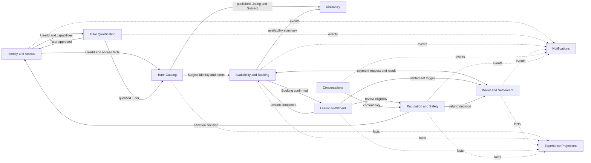

# Domain-Driven Design - Tutor Matcher

This page describes Tutor Matcher using domain-driven design (DDD). It is a strategic
and tactical model for discussing boundaries, ownership, invariants, and collaboration.
It does not require microservices, prescribe a database schema, or replace the product
requirements in [User Journeys](user-journeys.md).

## Evidence And Authority

The model follows this evidence order when documents overlap:

1. [`CONTEXT.md`](../CONTEXT.md) for canonical vocabulary.
2. The product prototype evidence under [`sources/`](sources/): its
   [walked behavior](sources/tutormatcher-prototype-readme.md),
   [user stories](sources/tutormatcher-prototype-user-stories.md), and
   [requirement DBML](sources/tutormatcher-prototype.dbml).
3. [User Journeys](user-journeys.md), then the [Project Charter](project-charter.md).
4. The requirement-level domain model in [Project Schema](project-schema.md).
5. [Backlog Reconciliation](backlog/reconciliation.md) and the editable
   [Git Backlog](backlog/README.md).
6. [Project Architecture](project-architecture.md), the [ADRs](adr/), and
   [Testing](testing.md).
7. The [Final Report Database Design](final-report-database-design.md), strictly as
   historical course evidence.

The current application code and physical database are deliberately excluded as domain
evidence. This page therefore describes the intended product domain, not implementation
completeness.

The model uses three confidence labels:

- **Product fact** - behavior or language established by higher-authority product evidence.
- **Proposed model** - a DDD boundary or name recommended to express the product facts.
- **Open decision** - behavior that the evidence does not settle consistently or completely.

## Domain Vision

Tutor Matcher is a two-sided tutoring marketplace. Its core business capability is
subject-scoped, slot-level, wallet-funded instant booking:

1. A Tutor publishes a Subject and advertises dated 30-minute Availability Slots for it.
2. A Student discovers the Tutor through the Subject, then selects one continuous block
   of available Slots.
3. The system calculates and snapshots the price from the Subject rate and selected Slots.
4. A successful Wallet payment confirms the Booking immediately; Tutor acceptance is not
   required because publishing availability is already a commitment.
5. Completion makes the Student eligible to review and starts Tutor earning settlement.

The differentiating domain is not generic profile management, video calling, or payment
transport. It is the trustworthy coordination of Subject discovery, published availability,
exclusive Booking, immediate payment, and the resulting marketplace history.

## Ubiquitous Language

[`CONTEXT.md`](../CONTEXT.md) remains the vocabulary authority. The terms below summarize
the language that determines boundaries and invariants; they do not redefine that glossary.

| Term               | Domain meaning                                                                                                  |
| ------------------ | --------------------------------------------------------------------------------------------------------------- |
| User               | One account. Student behavior is intrinsic; Tutor and Admin are added capabilities, not separate account types. |
| Tutor Application  | A User's request for the Tutor capability, supported by identity, certification, and bio evidence.              |
| Listing            | The admin-reviewed public presentation of a Tutor. Draft changes do not replace live content before approval.   |
| Subject            | A Tutor-owned teaching offering with its own description, rate, and format. It is the bookable unit.            |
| Availability Slot  | A Tutor-owned, dated 30-minute window that may advertise one or more of the Tutor's Subjects.                   |
| Booking            | One Student, one Tutor, one Subject, and one continuous block of adjacent Slots.                                |
| Lesson             | Fulfillment of a confirmed Booking. "Class" may be interface copy, but is not a separate offering entity.       |
| Wallet             | A User's monetary account combining top-ups and cleared earnings into spendable balance.                        |
| Wallet Transaction | An auditable money movement with type, direction, status, amount, and resulting balance.                        |
| Lesson Payment     | The Wallet debit that confirms a Booking.                                                                       |
| Earning            | The Tutor's net share of a completed Lesson, pending until settlement clears.                                   |
| Review             | Feedback from the Student's own completed Booking, scoped to its Tutor and Subject.                             |
| Report             | A complaint, flag, or dispute routed to an accountable moderation process.                                      |

The retired terms in `CONTEXT.md` must not return through lower-authority planning or
historical documents. In particular, do not model `Class` as the offering, transfer-proof
`Payment`, promotional `Post`, or separate Student and Tutor accounts.

## Subdomains

| Subdomain                | Classification                | Why                                                                                       |
| ------------------------ | ----------------------------- | ----------------------------------------------------------------------------------------- |
| Subject Marketplace      | Core                          | Makes Tutor offerings understandable and comparable at the Subject level.                 |
| Discovery                | Core                          | Matches a Student's query and filters to useful Tutor and Subject choices.                |
| Availability And Booking | Core                          | Turns Tutor commitments into an exclusive, continuous, correctly priced Booking.          |
| Wallet And Settlement    | Supporting, business-critical | Provides the financial guarantee that confirms Bookings and settles marketplace outcomes. |
| Tutor Qualification      | Supporting                    | Establishes whether a User may act publicly as a Tutor.                                   |
| Lesson Fulfillment       | Supporting                    | Delivers the confirmed Booking and determines completion.                                 |
| Reputation And Safety    | Supporting                    | Protects trust through verified Reviews, moderation, disputes, and sanctions.             |
| Conversations            | Supporting                    | Enables Student-Tutor communication before and after Booking.                             |
| Identity And Access      | Generic                       | Provides credentials, sessions, account state, and capabilities.                          |
| Notifications            | Generic                       | Delivers event-driven messages through enabled channels.                                  |
| Experience Projections   | Generic/read model            | Composes dashboards, tabs, summaries, and navigation from other contexts.                 |

"Supporting" does not mean optional. Wallet integrity, qualification, fulfillment, and
trust are necessary for the marketplace even though they are not its matching algorithm.

## Bounded Contexts

### Identity And Access

**Classification:** Generic subdomain.

**Owns:** User identity, credentials, account status, sessions, password recovery,
capabilities, and authorization facts.

**Does not own:** Tutor application approval, public Tutor content, Wallet balance,
Booking status, or moderation case decisions.

Other contexts refer to a stable `UserId`. Tutor Qualification may request that this
context grant the Tutor capability after approval. Admin is a capability used to invoke
authorized commands in owning contexts, not a separate "Admin context."

### Tutor Qualification

**Classification:** Supporting subdomain.

**Owns:** Tutor Application, Verification Documents, submission requirements, application
review, rejection reasons, cancellation, and approval outcome.

Approval grants a capability; it does not automatically publish arbitrary Listing changes.
Qualification answers "may this User act as a Tutor?" Tutor Catalog separately answers
"what approved Tutor content is public?"

### Tutor Catalog

**Classification:** Core subdomain under Subject Marketplace.

**Owns:** Tutor Listing, Listing revisions, Subject offerings, Subject lifecycle, rate,
format, descriptive content, and publication decisions.

A Subject has its own identity because Bookings, Availability Slots, Reviews, and Discovery
all refer to one specific offering. A Listing is not the Booking aggregate and must not
absorb availability or transaction history merely because the interface displays them
together.

### Discovery

**Classification:** Core subdomain.

**Owns:** Search language, supported filters and sorting, result ranking, public Tutor and
Subject projections, and no-result behavior.

Discovery consumes approved Catalog facts, published availability summaries, and reputation
summaries. It does not own Listing publication, Slot availability, or Reviews. "Recommended"
is an established sort option; personalized ranking based on a learner-interest profile is
not established product behavior.

### Availability And Booking

**Classification:** Core subdomain.

**Owns:** Tutor-owned Availability Slots, Subject assignment to Slots, continuous Slot
selection, price snapshots, Slot exclusivity, Booking lifecycle, cancellation, and release.

Availability and Booking share one bounded context because the most important invariants
span both languages: selected Slots must advertise the chosen Subject, form one continuous
block, remain exclusively claimable, and become unavailable when payment confirms the
Booking.

### Wallet And Settlement

**Classification:** Supporting, business-critical subdomain.

**Owns:** Wallet, available and pending amounts, Wallet Transactions, top-ups, Lesson
Payments, Earnings, Refunds, Payout Accounts, Payouts, and financial audit history.

Other contexts request money movements; they do not edit balances directly. Booking owns
confirmation while Wallet owns whether payment succeeded. The two contexts need an explicit
synchronous consistency policy for the immediate-confirmation invariant.

### Lesson Fulfillment

**Classification:** Supporting subdomain.

**Owns:** Meeting access, attendance evidence, join eligibility, and completion evaluation.

It begins from a confirmed Booking and reports fulfillment outcomes. It does not own the
commercial Booking or Wallet settlement. Meeting-provider concepts belong behind an adapter
and must not become domain entities.

### Conversations

**Classification:** Supporting subdomain.

**Owns:** Conversation identity, participants, ordered Messages, unread state, visibility,
and the Student/Tutor viewing context.

It may reference a Subject or Booking by identity without taking ownership of either.

### Reputation And Safety

**Classification:** Supporting subdomain.

**Owns:** Review eligibility, ratings, comments, Tutor replies, content flags, moderation
cases, dispute records, decisions, sanctions, and audit history.

Review eligibility depends on a completed Booking fact. Financial remedies are requested
from Wallet; account sanctions are requested from Identity. The moderation case records the
decision but does not mutate another context's state directly.

### Notifications

**Classification:** Generic subdomain.

**Owns:** Notification Preferences by event group and channel, delivery attempts, and
provider adapters.

It reacts to facts published by other contexts. Notification failure must not reverse a
Booking, payment, or moderation decision.

### Experience Projections

**Classification:** Generic/read-model capability.

**Owns:** No authoritative domain state. It composes Student and Tutor dashboards, Booking
tabs, Wallet summaries, route navigation, and other task-oriented views from context facts.

This capability may be implemented as query services or projections; it is not an aggregate
and should not become a write-owning bounded context.

## Context Map

The proposed map keeps the current modular-monolith direction from the architecture ADRs.
The arrows show the direction in which facts or decisions flow, not deployment boundaries.

Integration rules:

1. Identity is upstream for stable User identity and capability facts.
2. Catalog is upstream for published Tutor and Subject facts; Discovery is a consumer.
3. Booking and Wallet collaborate synchronously only where immediate confirmation requires
   one consistent outcome.
4. Lesson completion, notifications, dashboards, and search summaries may consume events
   after the owning transaction commits.
5. Cross-context references use stable identities and snapshots, not foreign object graphs.
6. Admin actions call the context that owns the decision; they do not bypass its rules.

## Aggregate Model

These are proposed consistency boundaries. An aggregate is not a page, table, epic, or API
module. It protects a small set of invariants through one root.

| Context                  | Aggregate root           | Owns or controls                                                              | Principal invariants                                                                                   |
| ------------------------ | ------------------------ | ----------------------------------------------------------------------------- | ------------------------------------------------------------------------------------------------------ |
| Identity And Access      | Account                  | Credentials, capabilities, account status                                     | One User identity; Student behavior is intrinsic; Tutor/Admin capabilities are additive.               |
| Tutor Qualification      | Tutor Application        | Verification Documents and review outcome                                     | Submission requires identity evidence, certification, and bio; only approval grants Tutor capability.  |
| Tutor Catalog            | Tutor Listing            | Live content and proposed revisions                                           | Rejected or pending revisions cannot replace approved public content.                                  |
| Tutor Catalog            | Subject                  | Description, hourly rate, format, publication state                           | One Tutor owns the Subject; a published Subject has complete booking terms.                            |
| Availability And Booking | Availability Slot        | Time window, Tutor owner, advertised Subjects, occupancy                      | Exactly 30 minutes; assigned Subjects belong to its Tutor; a paid Slot belongs to one Booking.         |
| Availability And Booking | Booking                  | Participants, Subject and terms snapshot, selected Slot references, lifecycle | Exactly 1-1; exactly one Subject; Slots are adjacent; price and schedule are immutable after creation. |
| Wallet And Settlement    | Wallet                   | Available balance, pending amount, accounting sequence                        | Every balance change has a Wallet Transaction; pending Earnings are not spendable.                     |
| Wallet And Settlement    | Payout                   | Amount, destination snapshot, processing state                                | Requester owns the destination and cannot withdraw more than available balance.                        |
| Lesson Fulfillment       | Lesson Session           | Meeting access, attendance evidence, completion outcome                       | Only participants in a confirmed Booking can join; completion follows one defined attendance policy.   |
| Conversations            | Conversation             | Participants and ordered Messages                                             | Messages belong to one participant pair; viewing role does not create a second account.                |
| Reputation And Safety    | Review                   | Rating, comment, reply, Booking provenance                                    | Reviewer owns the completed Booking; Review stays scoped to its Tutor and Subject.                     |
| Reputation And Safety    | Moderation Case          | Target reference, reports, evidence, decision, audit entries                  | Every outcome identifies its actor and reason; remedies go through the owning context.                 |
| Notifications            | Notification Preferences | Event/channel choices                                                         | A disabled event-channel pair suppresses delivery.                                                     |

### Aggregate Collaboration

Most aggregate changes should commit independently and publish facts afterward. The main
exception is successful Booking payment, where the product promises immediate confirmation
without double-spending or double-booking. The application policy must ensure that:

1. every selected Slot is still claimable for the selected Subject;
2. the Student has enough available Wallet balance;
3. the Wallet records exactly one successful Lesson Payment;
4. the Booking becomes confirmed exactly once; and
5. the Slots become exclusive to that Booking.

Whether this uses one database transaction or another consistency mechanism is an
implementation decision. The observable outcome above is the domain contract.

## Value Objects

| Value object       | Rules                                                                                            |
| ------------------ | ------------------------------------------------------------------------------------------------ |
| Money              | Amount plus currency; no floating-point arithmetic; explicit rounding policy for derived values. |
| Hourly Rate        | Positive Money amount attached to one Subject and snapshotted by a Booking.                      |
| Slot Window        | One dated half-hour interval in the Tutor's scheduling timezone.                                 |
| Booking Block      | Ordered, non-empty, adjacent Slot Windows with one Tutor and one Subject.                        |
| Price Snapshot     | Rate, Slot count, total, currency, and the time at which terms were accepted.                    |
| Capability         | Student behavior plus optional Tutor and Admin grants; not a mutually exclusive account role.    |
| Rating             | Integer from 1 through 5.                                                                        |
| Payout Destination | Bank and account details captured safely, with a display-safe representation.                    |
| Rejection Reason   | Required explanation attached to an application, publication, or moderation decision.            |
| Policy Version     | Identifier for the cancellation, fee, and settlement rules applied to a Booking.                 |

`Money`, `Slot Window`, `Booking Block`, and `Price Snapshot` carry core invariants and
should not be represented as unrelated primitive fields in domain behavior.

## Lifecycle Models

| Concept             | Established or proposed lifecycle                                                                                                                                  |
| ------------------- | ------------------------------------------------------------------------------------------------------------------------------------------------------------------ |
| Tutor Application   | `draft -> pending -> approved, rejected, or cancelled`; resubmission after cancellation is established, while reapplication after rejection is open.               |
| Listing Revision    | `draft -> pending review -> approved or rejected`; approval replaces live content, rejection preserves it.                                                         |
| Subject             | `draft -> published -> archived`; detailed transition permissions remain a proposed model.                                                                         |
| Availability Slot   | `closed -> open -> held? -> booked` and `held? -> open`; the hold state and expiry are open decisions.                                                             |
| Booking             | selection is not persisted, then `payment due -> confirmed -> completed or cancelled`; dispute and refund are related processes, not automatically Booking states. |
| Wallet Transaction  | `pending -> succeeded, failed, or cancelled`; exact transitions vary by transaction type.                                                                          |
| Earning             | `pending -> cleared`; failed or reversed settlement needs a product decision.                                                                                      |
| Review              | `published -> replied` and independently `published -> flagged -> kept, hidden, or removed`.                                                                       |
| Moderation Case     | `open -> under review -> resolved`; target-specific outcomes remain in their owning contexts.                                                                      |
| Account Enforcement | `active -> suspended or banned`; restoration and appeal behavior are open.                                                                                         |

Lifecycle alternatives are not concurrent states. Names are proposed unless they appear in
the product evidence; they should be finalized with product policy before becoming
persistence enums.

## Commands And Events

Commands express intent and may fail. Events state facts that already happened. Names below
are proposed domain language, not existing API contracts.

| Context                  | Representative commands                                                                                          | Representative events                                                                                                   |
| ------------------------ | ---------------------------------------------------------------------------------------------------------------- | ----------------------------------------------------------------------------------------------------------------------- |
| Identity And Access      | `RegisterUser`, `RequestPasswordReset`, `GrantTutorCapability`, `SuspendAccount`                                 | `UserRegistered`, `TutorCapabilityGranted`, `AccountSuspended`                                                          |
| Tutor Qualification      | `SubmitTutorApplication`, `CancelTutorApplication`, `ApproveTutorApplication`, `RejectTutorApplication`          | `TutorApplicationSubmitted`, `TutorApplicationCancelled`, `TutorApplicationApproved`, `TutorApplicationRejected`        |
| Tutor Catalog            | `SubmitListingRevision`, `ApproveListingRevision`, `CreateSubject`, `PublishSubject`, `ArchiveSubject`           | `ListingRevisionSubmitted`, `ListingPublished`, `SubjectPublished`, `SubjectArchived`                                   |
| Discovery                | `SearchTutors`                                                                                                   | `SearchPerformed` only if analytics requires a durable business fact                                                    |
| Availability And Booking | `OpenAvailability`, `AssignSubjectsToSlot`, `ChooseBookingBlock`, `CreateBooking`, `PayBooking`, `CancelBooking` | `AvailabilityPublished`, `BookingAwaitingPayment`, `BookingConfirmed`, `BookingCancelled`, `SlotsReleased`              |
| Wallet And Settlement    | `ConfirmTopUp`, `PayForBooking`, `ClearEarning`, `CreditRefund`, `RequestPayout`                                 | `TopUpCredited`, `LessonPaymentSucceeded`, `LessonPaymentFailed`, `EarningCleared`, `RefundCredited`, `PayoutRequested` |
| Lesson Fulfillment       | `ProvisionMeeting`, `JoinLesson`, `EvaluateCompletion`                                                           | `MeetingProvisioned`, `LessonCompleted`, `LessonCompletionFlagged`                                                      |
| Conversations            | `StartConversation`, `SendMessage`, `MarkConversationRead`                                                       | `ConversationStarted`, `MessageSent`, `ConversationRead`                                                                |
| Reputation And Safety    | `SubmitReview`, `ReplyToReview`, `FlagContent`, `ResolveCase`                                                    | `ReviewPublished`, `ReviewReplied`, `ContentFlagged`, `ModerationCaseResolved`                                          |
| Notifications            | `ChangeNotificationPreferences`, `DispatchNotification`                                                          | `NotificationPreferencesChanged`, `NotificationDelivered`, `NotificationFailed`                                         |

Avoid publishing events for every field update. An event is useful when another context has
a legitimate business reaction, an audit requirement exists, or a durable process continues
after the initiating transaction.

## Domain Policies

### Instant Booking

1. Accept one Subject and a non-empty ordered Slot selection.
2. Reject Slots that are not adjacent, do not advertise the Subject, or are no longer
   available.
3. Calculate `slot count x hourly rate / 2` and store the accepted schedule and price.
4. Create the payment-due Booking only after a date and Slot block have been chosen.
5. Recheck Slot exclusivity before taking Wallet funds.
6. On successful payment, atomically produce one confirmed Booking, one Lesson Payment,
   and exclusive Slot occupancy.
7. On failure, do not leave a confirmed Booking or consumed funds.

The exact pre-payment hold and expiry mechanism is open.

### Insufficient Balance

The payment-due Booking retains its accepted context while the Student is directed to top
up the shortfall. The Student returns to that Booking after top-up. Slot hold duration and
the response when the Slots expire during top-up are open decisions.

### Completion And Settlement

A confirmed Booking supplies meeting access. When the completion policy succeeds, the
Lesson completes, Review eligibility opens, and the Tutor's net Earning enters pending
settlement. The Earning becomes available only after clearing.

### Cancellation And Refund

Cancellation applies a versioned policy, changes the Booking outcome, removes future lesson
access, releases or closes Slots according to Tutor intent, and requests any eligible Refund
from Wallet. The cancellation window and refund amount must not be hard-coded from unsigned
prototype copy.

### Controlled Publication

Tutor Application approval grants the Tutor capability. Listing and Verification Document
changes become public only after approval. A rejected change preserves the current live
version and records a reason.

### Review And Moderation

Only the Student's own completed Booking establishes Review eligibility. A Tutor may reply
through the Review aggregate. Flags open or contribute to a Moderation Case; moderation can
change visibility but must preserve an audit trail.

## Product Invariants

These facts should be protected regardless of interface or persistence design:

1. One User account carries Student behavior and optional Tutor/Admin capabilities.
2. Subject is the bookable offering.
3. Availability belongs to a Tutor; Subjects are assigned to Slots.
4. A Slot is exactly 30 minutes.
5. A Booking is 1-1, Subject-scoped, and one continuous, non-recurring Slot block.
6. No Booking exists while the Student is only browsing dates and Slots.
7. Price is based on accepted Slot count and Subject rate, then preserved as history.
8. Payment, not Tutor acceptance, confirms a Booking.
9. A paid Slot belongs to exactly one Booking.
10. Every balance change has an auditable Wallet Transaction.
11. Pending Earnings are not part of available balance.
12. Any User with sufficient available balance may request a Payout.
13. Review eligibility comes from the reviewer's own completed Booking and remains scoped
    to that Booking's Tutor and Subject.
14. Pending or rejected Listing and document changes do not replace live content.
15. Route and command authorization follows account capabilities.

The canonical schema additionally expects one Review per Booking. Product evidence confirms
Booking-based eligibility but does not state that cardinality as clearly, so the constraint
should be confirmed before implementation.

## Open Domain Decisions

| Decision                                 | Why it matters                                                                                                                     |
| ---------------------------------------- | ---------------------------------------------------------------------------------------------------------------------------------- |
| Pre-payment Slot hold and expiry         | Determines concurrency, payment retries, top-up return behavior, and Slot release.                                                 |
| Rescheduling scope                       | The prototype implements cancellation, while planning and one product story mention rescheduling.                                  |
| Online and in-person fulfillment         | Subject format includes both, but meeting and completion behavior is specified mainly for online Lessons.                          |
| Cancellation and Refund policy           | The mechanism exists, but the time window and amount require product approval.                                                     |
| Platform fee and Earning clearing period | Prototype numbers are provisional and affect every financial snapshot and settlement.                                              |
| Attendance and automatic completion      | Determines when settlement and Review eligibility begin and how exceptions are handled.                                            |
| Reapplication after rejection            | The pending cancellation/resubmission path is known; rejected application recovery is not.                                         |
| Subject-change review                    | Listing and document review are explicit; approval requirements for Subject changes are not.                                       |
| Slot behavior after cancellation         | The Slot may reopen or remain closed according to Tutor intent; no rule is settled.                                                |
| Financial failure and reversal           | Top-up, payment, Refund, Earning, and Payout retries need idempotency and recovery semantics.                                      |
| Review cardinality                       | The schema reference says one per Booking; higher-authority product evidence establishes eligibility but not the limit explicitly. |
| Timezone policy                          | Dated Slots, reminders, cancellation windows, and completion require one scheduling-time interpretation.                           |
| Account restoration and appeals          | Suspension and bans are in scope, but duration, restoration, and appeal paths are undefined.                                       |
| Admin capability assignment              | Admin behavior is specified, but who grants or revokes the capability is not.                                                      |

No lower-authority backlog story should settle these decisions implicitly.

## Backlog Alignment

Backlog epics are delivery categories, not bounded contexts. The same epic may coordinate
several domain owners:

| Backlog epic | Primary DDD contexts                                            |
| ------------ | --------------------------------------------------------------- |
| AUTH         | Identity And Access; Tutor Qualification                        |
| PROF         | Tutor Catalog; Availability And Booking; Experience Projections |
| DISC         | Discovery; Tutor Catalog projections                            |
| BOOK         | Availability And Booking; Wallet And Settlement                 |
| PAY          | Wallet And Settlement                                           |
| CLASS        | Lesson Fulfillment; Availability And Booking                    |
| MSG          | Conversations; Notifications                                    |
| REV          | Reputation And Safety                                           |
| SAFE         | Tutor Qualification; Reputation And Safety; Identity; Wallet    |

[Backlog Reconciliation](backlog/reconciliation.md) must be applied before treating planning
records as domain requirements. The highest-impact conflicts are role selection at sign-up,
recurring or group Booking, lesson credits, saved payment methods, learner-interest profiles,
weekly availability, and booking from a general Tutor page instead of a Subject.

The backlog also lacks complete coverage for capabilities already present in product evidence,
including route guards, the Tutor Application lifecycle, Subject management, Subject-to-Slot
assignment, Subject detail, continuous block selection, unified Wallet behavior, Listing review,
payment disputes, and cross-context dashboard projections.

## Architecture Guidance

The accepted separate frontend/backend and monorepo decisions support a modular monolith.
DDD boundaries should first be enforced inside the existing backend application; no evidence
requires independently deployed services.

1. Organize behavior by bounded context rather than by database table or screen.
2. Give every write model one owning context; other contexts use its commands, facts, and IDs.
3. Keep API schemas, application orchestration, domain rules, and infrastructure adapters
   conceptually separate, but create abstractions only when real behavior needs them.
4. Keep synchronous coordination for invariants that must succeed or fail together, especially
   Slot exclusivity and Lesson Payment confirmation.
5. Use committed domain events for Notifications, Discovery indexes, dashboards, and other
   projections that may update after the business transaction.
6. Treat dashboards and search results as read models assembled from authoritative contexts.
7. Keep payment, meeting, document-storage, email, and push-provider language behind adapters.
8. Enforce boundaries incrementally in vertical product slices rather than creating empty DDD
   layers for unimplemented capabilities.

## Testing Strategy

The [Testing](testing.md) page establishes Jest, Supertest, Cucumber, and frontend test
infrastructure. Apply those tools at distinct DDD seams:

| Test level                    | Purpose                                                                                                   |
| ----------------------------- | --------------------------------------------------------------------------------------------------------- |
| Value-object tests            | Money arithmetic, Slot adjacency, Booking Block construction, Rating, and policy-version behavior.        |
| Aggregate tests               | Lifecycle transitions and invariant rejection without HTTP or provider dependencies.                      |
| Application-policy tests      | Cross-aggregate command orchestration, authorization, retries, and emitted events.                        |
| Persistence integration tests | Uniqueness, transaction rollback, locking, idempotency, and durable audit history.                        |
| API contract tests            | Validation, status codes, authorization boundaries, and stable transport shapes.                          |
| Journey tests                 | Product outcomes across registration, qualification, discovery, Booking, Wallet, fulfillment, and Review. |
| Projection tests              | Search, dashboard, tabs, and ledger views update from source facts without becoming write authorities.    |

The first behavior scenarios should protect the invariants in this page, especially Tutor
capability approval, Subject-to-Slot assignment, continuous Booking Blocks, payment-confirmed
Booking, Wallet auditability, and completed-Booking Review eligibility.

## Historical Lessons

The Final Report describes an obsolete product model, but several engineering lessons remain
useful when translated into current language:

1. Lock and validate lifecycle state before a concurrent transition.
2. Keep related state and financial changes atomic where partial success would violate a
   business invariant.
3. Reinforce durable invariants with database constraints rather than relying only on pages
   or application branches.
4. Avoid storing two fields for the same fact unless they represent distinct business intent
   and have a consistency rule.
5. Anchor a Review to the exact qualifying Booking.
6. Calculate financial outcomes from immutable Booking terms and auditable Wallet Transactions.
7. Store cancellation and moderation history as structured records, not appended user text.
8. Use embedded or denormalized shapes for read projections only when write-model lifecycles
   remain independently protected.

Historical `Person`, `Class`, `AvailableTime`, transfer-proof `Payment`, `Post`, and embedded
MongoDB Review structures are not current domain concepts and must not drive implementation.

## Recommended Domain Delivery Order

1. Resolve product and backlog conflicts that would otherwise create obsolete aggregates.
2. Establish Identity and Tutor Qualification, including capability grant semantics.
3. Establish Tutor Catalog and Subject-owned commercial terms.
4. Establish Tutor-owned Availability Slots and Subject assignment.
5. Implement the core Booking-Wallet collaboration with explicit concurrency and failure rules.
6. Add Lesson Fulfillment, completion, and Earning settlement.
7. Add Conversations, Notifications, Reviews, moderation, and financial disputes.
8. Build Discovery and Experience Projections from authoritative context facts throughout the
   sequence rather than letting projections own write state.

This order describes dependency and risk, not a commitment to a particular Sprint. Sprint scope
remains a product-owner decision governed by the backlog contract.
