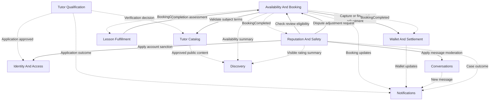

# Microservice Design with Collaborations — Tutor Matcher

**Status:** Proposed architecture, not an accepted ADR or a description of deployed services.
**Updated:** 2026-09-07.

Merging this document approves its presence as a proposal, not service extraction or a new
production topology. Accepted [architecture decisions](index.md#architecture-decisions) remain in force.

## Authority and scope

This is the deployment and collaboration companion to the
[Domain-Driven Design — Tutor Matcher](https://github.com/Azther0z/tutor-matcher/blob/4f5e34d4da453700d468b14e144a40ac9b670807/docs/domain-driven-design.md).
The domain model defines business ownership and rules; this document explains how those contexts
collaborate and how they may be grouped into deployments.

| Reference                                                                                                                                      | Authority                                                                                                         |
| ---------------------------------------------------------------------------------------------------------------------------------------------- | ----------------------------------------------------------------------------------------------------------------- |
| [User journeys](user-journeys.md), [charter](project-charter.md), and preserved [prototype evidence](sources/tutormatcher-prototype-readme.md) | Product behavior and scope; provisional policy numbers still require product approval                             |
| [CONTEXT.md](../CONTEXT.md)                                                                                                                    | Canonical terminology                                                                                             |
| DDD model linked above                                                                                                                         | Proposed logical ownership, aggregates, value objects, and invariants derived from the product                    |
| This document                                                                                                                                  | Proposed deployment grouping, collaborations, transaction boundaries, and failure recovery                        |
| [Project architecture](project-architecture.md) and accepted ADRs                                                                              | Approved technical architecture                                                                                   |
| [Project schema](project-schema.md)                                                                                                            | Requirement constraints and documented implementation gaps; Prisma and migrations remain implementation authority |

Follow product requirements → domain model → service design → accepted technical decisions →
implementation. This page links to domain rules rather than maintaining another aggregate catalog.
It excludes `backlog.yaml` and other backlog artifacts as requirement evidence, including the DDD
model's planning discussion. Historical database-course designs do not establish requirements here.
No new prototype walkthrough was needed. Contract names and recovery mechanisms below are proposals.

## Domain contexts, modules, and deployment

Start with the existing Express backend, Next.js frontend, monorepo, PostgreSQL, and Compose
architecture. A bounded context defines logical ownership; a deployment defines what runs and is
released together. There is no target service count. Keep context boundaries inside the backend
before extracting any process.

The module names below are proposed responsibilities, not a claim that the folders already exist.
All contexts initially share the backend deployment; workers may run alongside it. Booking and
Wallet additionally share a deliberate payment transaction boundary.

| DDD context              | Owning module responsibility                                                              | Initial deployment                          | Possible extraction, subject to evidence                                        |
| ------------------------ | ----------------------------------------------------------------------------------------- | ------------------------------------------- | ------------------------------------------------------------------------------- |
| Identity And Access      | `auth` and account settings; capabilities and account restrictions                        | Express backend                             | Identity service if access/security operations require independent ownership    |
| Tutor Qualification      | `qualification`; applications, verification documents, approval outcomes                  | Express backend                             | Can share a tutor service with Catalog while retaining a separate model         |
| Tutor Catalog            | `catalog`; approved Listing, revisions, Subjects and accepted commercial terms            | Express backend                             | Tutor service; Qualification remains the authority on eligibility and documents |
| Discovery                | `discovery`; search language, filters, ranking and rebuildable search projections         | Express backend                             | Search worker/service if indexing load or ranking release cadence warrants it   |
| Availability And Booking | `booking`; tutor-owned slots, subject assignments, holds, Booking lifecycle and snapshots | Express backend, shared payment transaction | Booking service only after remote payment recovery is proven                    |
| Wallet And Settlement    | `wallet`; ledger, pending/available funds, provider attempts and settlement               | Express backend, shared payment transaction | Wallet service only after ledger migration and reconciliation are proven        |
| Lesson Fulfillment       | `classroom`; meeting adapter, attendance evidence and completion assessment               | Express backend and durable worker          | Provider worker/service if failures or processing load need isolation           |
| Conversations            | `messaging`; participant threads, messages, unread state and visibility                   | Express backend                             | Conversation service if connection/load needs justify it                        |
| Reputation And Safety    | `reputation`; separate review and moderation/dispute modules under one context            | Express backend                             | Reputation service; retain explicit review and case responsibilities            |
| Notifications            | `notifications`; preferences, reminders and delivery attempts                             | Express backend and durable worker          | Notification worker/service if delivery retries or throughput need isolation    |
| Experience Projections   | `dashboard` and API composition; no authoritative domain writes                           | Express backend                             | Query layer only if composition load warrants it                                |

Each context owns its writes; other contexts use its commands, queries, IDs, or committed facts.
Shared deployment does not allow arbitrary repository access. Extracted services use owner-specific
credentials and migrations, with no cross-database joins or shared Prisma persistence models.
The initial Booking–Wallet operation invokes both owners within one application transaction.

Discovery owns search behavior, including the meaning of ranking, even though its data is rebuilt
from Catalog, Booking, and Reputation facts. It cannot authorize bookings or supply authoritative
inventory/prices. Experience Projections composes dashboards and admin queues without gaining write
ownership. Next.js continues to call the same-origin `/api/*` interface through Express.

For readability below, Booking means Availability And Booking, Wallet means Wallet And Settlement,
Fulfillment means Lesson Fulfillment, and Reputation means Reputation And Safety. Reviews and
moderation are modules within Reputation; Notifications is always a separate context.

## Collaboration map

This diagram shows selected context interactions, not a container per box. The API routes commands
to each owner; authorization is enforced both at entry and by the owner. Dashed arrows carry committed
facts; solid arrows are commands or authoritative queries. Durable event transport is needed when
these interactions cross processes, not merely because contexts have different names.



## Collaboration 1: qualification, publication, and discovery

Qualification owns application/document submissions and versioned admin decisions. Approval publishes
`TutorApplicationApproved`; Identity grants the capability once and acknowledges activation. Until
then, protected tutor actions remain blocked. Cancellation and approval compete on the submission
version so a superseded application cannot be approved accidentally.

Catalog owns proposed and live listing revisions. Qualification owns replacement verification
versions and their review outcomes. When a listing revision depends on replacement documents,
Catalog references the exact approved document version before publishing; it does not independently
approve private documents. Rejection leaves approved public content intact. This coordination is a
proposed implementation of the [documented review flow](user-journeys.md#7--tutor-operations).

Discovery consumes approved Catalog content, availability summaries, and visible ratings. Booking
revalidates bookability with Catalog and records the accepted subject quote/version so later price
changes do not rewrite history. Public search lag must never authorize an unavailable slot.

## Collaboration 2: select slots, top up, and confirm

The sequence shows the proposed workflow after Booking and Wallet are extracted. Initially, the
payment portion runs as one shared database transaction, as described below. Browser requests go
through the API layer even where the diagram abbreviates the response path.

```mermaid
sequenceDiagram
    actor Student
    participant API as Express API
    participant B as Availability And Booking
    participant C as Tutor Catalog
    participant W as Wallet
    participant L as Lesson Fulfillment
    Student->>API: Continue with subject and continuous slot block
    API->>B: CreateBooking with idempotency key
    B->>C: Validate bookability and obtain subject quote
    C-->>B: Tutor, subject version, rate, format
    B->>B: Atomically claim all slots and save payment-due booking
    B-->>Student: Booking number, fixed price, payment page
    opt Insufficient available balance
        Student->>API: Request top-up QR
        API->>W: Create top-up attempt
        W->>W: Verify provider confirmation and credit once
        W-->>Student: Updated wallet; return to booking
    end
    Student->>API: Pay booking with idempotency key
    API->>B: PayBooking
    B->>B: Pin valid hold to durable payment attempt
    B->>W: CaptureLessonPayment with attempt ID and fixed amount
    W->>W: Atomically debit available funds and record result
    W-->>B: Durable payment reference
    B->>B: Confirm booking and persist BookingConfirmed event
    B-->>Student: Confirmed booking and payment reference
    B-->>L: BookingConfirmed via durable events
    L->>L: Provision online meeting and persist reference
```

**Local correctness.** No booking exists while merely selecting time. Continuing locks the complete
block or creates nothing. Validate contiguity, subject assignments, tutor ownership, publication,
future times, and the documented booking horizon. Lock slots in a deterministic order and enforce
one active claim per tutor/slot, across all subjects advertising that slot. Availability edits must
respect unpaid holds as well as paid locks. Store start/end, duration, subject/rate version, total,
currency, and policy version on the booking. Calculate money with exact decimal or minor-unit
arithmetic and an explicit rounding rule.

**Initial implementation.** While Booking and Wallet share one transactional database, the payment
operation should atomically validate the hold, debit the wallet, and confirm the booking. Module
ownership still applies; this is a deliberate shared transaction boundary before service extraction.

**After service extraction.** There is no shared transaction. Booking orchestrates a durable payment
workflow with these constraints:

- Before sending a capture, persist an attempt and pin its slots. Expiry and cancellation cannot
  release those slots while the capture outcome is unknown. Do not hold a database transaction open
  across a network call.
- Wallet accepts captures only from authenticated Booking callers, checks the server-supplied amount
  and payer, serializes competing debits, and enforces one successful lesson payment per booking.
  Repeating an attempt returns the same result; changing its payload is rejected.
- If Wallet commits but the response is lost, Booking queries/retries that same attempt and confirms
  from the recorded result. A timeout is not evidence that payment failed. Keep the UI in a recoverable
  processing state and retain slots until reconciliation resolves it.
- To abandon an uncertain attempt, obtain a durable terminal rejection/abort from Wallet. That result
  must prevent a delayed capture for the same attempt. Only then may Booking release the slots or
  allow a new attempt. An unpaid hold with no in-flight capture can expire locally.
- On success, Booking records confirmation and its outbox event together. Recovery repeats this
  transition safely after a crash. Do not refund a second student's payment as a way to resolve
  double-selling: competing claims must fail before either invalid capture is sent.

The normal response confirms payment immediately without tutor approval. During partial failures,
the system cannot promise simultaneous visibility in two databases; it must reconcile and expose
processing honestly. This cost is the main reason to defer Booking/Wallet extraction.

**Meeting readiness.** Provision the meeting idempotently using the booking ID. A provider outage
must not charge again or erase confirmation. Booking detail composes the meeting reference once
available, with an explicit retrying state meanwhile. This temporary state is a proposed failure UX
that needs agreement; the normal documented confirmed screen includes the meeting link.

## Collaboration 3: delivery, completion, earnings, and reviews

1. Lesson Fulfillment consumes `BookingConfirmed`, provisions the online room, and authorizes the
   booking's student/tutor before exposing a join link. A cancellation prevents subsequent joins.
2. After the scheduled lesson, Fulfillment submits attendance evidence and a completion assessment.
   Booking checks its current state and the applicable completion rule before moving `confirmed`
   to `completed`. Missing or inadequate evidence is flagged rather than silently counted as delivery.
3. Booking publishes `BookingCompleted`. Wallet creates the tutor's pending earning once, using the
   booking's financial allocation and policy snapshot. Pending money cannot fund bookings or payouts.
4. A durable Wallet worker clears eligible earnings once the clearing time and any dispute hold permit
   it. Clearing transfers pending money into available money; it must not credit the earning twice.
5. Reputation's review module checks the caller against Booking's authoritative completed booking
   before accepting a submission. It derives tutor and subject IDs and enforces uniqueness on
   booking ID. It does not trust a browser-supplied tutor/subject pair or a stale completion projection.
6. Reputation publishes changes to visible ratings for Discovery. Tutor replies require ownership of
   the reviewed tutor's account. Notifications dispatch eligible completion and earning updates.

**Completion authority:** `BookingCompleted` is the accepted commercial outcome that starts pending
earnings and establishes review eligibility. A Fulfillment assessment alone cannot trigger either.
Booking serializes acceptance against cancellation on its current version; a delayed assessment for
a cancelled booking is rejected. This refines the domain model's direct Fulfillment → Wallet/Reputation arrows
and should be reconciled in its context map and EventStorming board before implementation.

## Collaboration 4: cancellation, disputes, and refunds

1. Booking authorizes the participant, checks lifecycle state, calculates a cancellation quote from
   the applicable policy, and shows the consequence before confirmation. Quote/version validation
   prevents a stale quote from silently applying a different financial outcome.
2. An unpaid cancellation releases its hold only if no payment attempt can still capture. A paid
   cancellation records `cancelled`, removes booking occupancy, and persists a refund instruction
   together. Reopening the released slots for sale requires the agreed cancellation policy.
   Cancellation and completion serialize on the booking version so only one transition wins.
3. Wallet applies the authorized financial adjustment idempotently. If Wallet is unavailable, the
   booking stays cancelled and the refund is visibly pending; a durable retry completes it later.
4. Reputation's moderation module owns the dispute and audits the admin decision. It requests an
   adjustment through Booking; Wallet executes the authorized financial change.
5. Wallet serializes refunds, earnings clearing, and dispute holds against the same booking allocation.
   It caps cumulative refunds at the eligible paid amount and prevents both a full refund and an
   unadjusted tutor earning from being allocated from the same money.

A refund after earnings have cleared or been paid out requires an explicit funding/recovery policy.
Record that as an unresolved case until the policy exists; do not silently take another user's
available money or invent a negative-balance rule. Rescheduling is outside this proposal while its
product scope remains unresolved.

## Collaboration 5: top-ups and payouts

Wallet owns provider adapters and authoritative transaction outcomes. A browser redirect or a fake
prototype success action cannot credit money. A top-up is credited only after authenticated provider
confirmation, with a unique provider transaction reference and verified amount, currency, and user.

Any user can request a payout to their saved Payout Account. Wallet checks account ownership and
available funds, then atomically makes the amount unavailable and records the payout attempt. A
durable worker submits it with a stable provider reference. Success finalizes the debit; a definitive
failure restores funds through a recorded adjustment. An unknown outcome stays pending and is
reconciled before either resubmission or restoration. Concurrent booking payments and payouts cannot
spend the same available funds.

Maintain an immutable financial journal with balanced internal allocations for funds awaiting lesson
delivery, tutor earnings, platform fees, and external transfers. These are accounting allocations,
not additional student/tutor wallets. Derive the user-facing transaction history and balance from
that journal; any cached balance is updated atomically with its entries and can be reconciled.

## Collaboration 6: conversations, moderation, and notifications

Conversations authorizes the participants and owns message visibility. Reputation owns content flags,
cases, review visibility, and decisions. A review moderation decision applies within Reputation;
a message decision calls Conversations and remains pending until acknowledged. Duplicate flags and
repeated moderation commands are deduplicated. Account sanctions go through Identity, whose current
restrictions must be enforced despite stale UI or token state.

Notifications independently consumes committed outcomes. It checks current event/channel preferences
on every dispatch and retry, and checks booking status/time before reminders. Delivery failure cannot
reverse a booking, payment, or moderation decision. Password reset delivery remains separate from
optional product notifications. These responsibilities need no shared domain model with moderation.

## Contracts, reliability, and security

| Contract                              | Caller → owner                        | Result or event                                   | Consistency                                                          |
| ------------------------------------- | ------------------------------------- | ------------------------------------------------- | -------------------------------------------------------------------- |
| `CreateBooking`                       | API → Booking                         | Fixed-price payment-due booking and slot claim    | Atomic across every selected slot                                    |
| `PayBooking` / `CaptureLessonPayment` | API → Booking → Wallet                | Payment reference, then `BookingConfirmed`        | Shared transaction initially; durable orchestration after extraction |
| `CancelBooking`                       | API → Booking                         | `BookingCancelled`, authorized refund instruction | Booking/inventory atomic; refund completion may lag                  |
| `AssessCompletion`                    | Fulfillment → Booking                 | `BookingCompleted` if eligible                    | Version-checked lifecycle transition                                 |
| `ApproveApplication`                  | Admin API → Qualification             | `TutorApplicationApproved` → Identity             | Approval durable; capability activation acknowledged separately      |
| `SubmitReview`                        | API → Reputation → Booking query      | `ReviewPublished`                                 | Authoritative eligibility and local uniqueness                       |
| `RequestPayout`                       | API → Wallet                          | Durable payout attempt                            | Available balance and payout debit atomic                            |
| `ResolveReport`                       | Admin API → Reputation → domain owner | Audited, acknowledged outcome                     | Idempotent commands with retry                                       |

Commands carry actor identity, an idempotency key, and an expected version where state can race.
Events carry `eventId`, `eventType`, `schemaVersion`, `aggregateId`, `aggregateVersion`, `occurredAt`,
and correlation/causation IDs. Financial instructions additionally carry stable booking/payment
references, exact amount/currency, and the relevant policy version. Internal contracts are versioned
separately from frontend page URLs; the journeys specify pages, not REST endpoint contracts.

Use a transactional outbox: persist a state change and the event to publish in the same local
transaction. Consumers atomically deduplicate event IDs with their own state changes. Assume
at-least-once delivery; use aggregate versions to reject stale projection updates and detect gaps.
Retries use bounded backoff, with failed work retained for inspection and replay. An event transport
is required for extracted services, but no broker product is selected by this proposal.

Do not put passwords, reset tokens, verification documents, bank details, or meeting secrets in broad
event payloads. Use private storage references and authorized retrieval. Authenticate service calls,
authorize money commands by service and actor, and maintain decision IDs across admin actions and
financial adjustments. Services have separate database credentials; shared hosting does not grant
cross-service table access.

Track payment attempts with unknown outcomes, held slots past expiry, outbox age, failed callbacks,
pending refunds/payouts, meeting provisioning failures, and ledger reconciliation differences.
Correlation IDs must connect the browser request, booking, wallet operation, provider reference, and
admin resolution without logging sensitive payloads.

## Adoption and extraction gates

1. Establish the context/module mapping inside Express through working product slices. Use the
   [schema gap list](project-schema.md#reconciliation-requirement-vs-implementation) for implementation
   planning; this proposal does not close G1–G18 or require empty domain layers.
2. Implement the local Booking–Wallet transaction, owner contracts, outbox, and durable workers.
   Prove the failure scenarios below while the deployment remains simple.
3. Consider Notifications, Fulfillment workers, or Discovery first when measured load, provider
   failure isolation, or release ownership supports extraction. Document the concrete benefit,
   operating owner, latency/failure budget, data migration, monitoring, and rollback plan in an ADR.
4. Separate Booking and Wallet only after the uncertain-payment protocol is tested end to end.
   Reconcile financial backfills, switch to one writer per domain, and avoid indefinite dual writes.

Every extraction needs versioned contracts, owner-specific persistence, replay/recovery procedures,
health checks, and local/production Compose entries. Accept the topology ADR before deployment.
Remain with the modular backend if the operational benefit does not justify the added failure modes.

## Verification criteria

Extend the existing [Jest/Supertest and Cucumber suites](testing.md) with observable domain scenarios.
Use real database transactions for race and ledger tests, controlled provider stubs for callbacks,
contract tests for extracted services, and browser journeys for the user-visible result.

| Scenario                                                                    | Required evidence                                                                   |
| --------------------------------------------------------------------------- | ----------------------------------------------------------------------------------- |
| Two students select overlapping slots, including through different subjects | Only one complete block is held; losing request makes no debit                      |
| Duplicate Pay, lost Wallet response, or process crash after debit           | One debit and eventual confirmation; inventory retained until outcome resolved      |
| Hold expiry races a delayed capture                                         | No released slot can subsequently be paid through the abandoned attempt             |
| Payout races a booking payment                                              | Available funds cannot be spent twice or go below the allowed balance               |
| Top-up/payout callbacks repeat or arrive late                               | One financial outcome; unknown outcomes do not trigger blind credit or resubmission |
| Cancellation races completion or earning clearing                           | One legal booking transition and a consistent refund/earning allocation             |
| Admin rejects a listing revision                                            | Previously approved public content remains unchanged                                |
| Review submitted before completion or for another student's booking         | Rejected; tutor/subject cannot be forged; duplicate review rejected                 |
| Meeting provider or notification delivery is unavailable                    | Booking remains correct; work retries; disabled channels stay suppressed            |
| Account is suspended after login                                            | Subsequent protected commands are denied despite old UI state                       |

## Established requirements and reconciliation points

| Topic                  | Basis and treatment in this proposal                                                                                                                                                                                                                                                                                                                      |
| ---------------------- | --------------------------------------------------------------------------------------------------------------------------------------------------------------------------------------------------------------------------------------------------------------------------------------------------------------------------------------------------------- |
| Payment-due holds      | [Booking step 2](user-journeys.md#step-2--payment-due-bookingsid) explicitly holds slots while payment is outstanding. Holding is established; lifetime, expiry, and top-up return after expiry remain open. DDD's optional `held?` notation should be aligned.                                                                                           |
| One review per booking | [Schema integrity rule 9](project-schema.md#integrity-rules-the-product-requires) documents this requirement; review submission remains optional. This proposal enforces at most one submitted review. DDD flags weaker explicit prototype evidence, so any change to that documented limit needs a product decision rather than a service-specific rule. |
| Completion gate        | Booking accepts Fulfillment evidence before Wallet settlement and review eligibility. This is a proposed coordination decision; reconcile DDD's direct completion reactions before implementation.                                                                                                                                                        |
| Dispute remedies       | Reputation decides the remedy; Booking validates the booking adjustment and Wallet owns its financial execution. This refines DDD's direct Reputation → Wallet path to serialize booking-related outcomes.                                                                                                                                                |

These are explicit alignment points between proposals; neither document silently overrides the other
or changes product requirements by being merged.

## Decisions still needed

Keep the full domain questions in the DDD model. The following decisions directly affect collaboration
contracts or extraction and remain open here:

| Decision                                                                        | Impact                                                                                                                    |
| ------------------------------------------------------------------------------- | ------------------------------------------------------------------------------------------------------------------------- |
| Hold lifetime and top-up return after expiry                                    | Slot release, payment attempts, and recovery UI                                                                           |
| Timezone and scheduling interpretation                                          | Slot boundaries, reminder times, cancellation windows, and completion deadlines                                           |
| Whether cancelled slots reopen or remain closed                                 | Separate removal of booking occupancy from permission to sell the slot again                                              |
| Cancellation/refund matrix, fee rounding, policy versioning and clearing period | Financial snapshots and adjustments; prototype numbers remain provisional as stated in [Money](user-journeys.md#4--money) |
| Dispute holds and refunds after cleared earnings or payouts                     | Financial recovery and responsibility for funding refunds                                                                 |
| Attendance rules, evidence source and in-person fulfillment                     | Completion acceptance; online meeting evidence does not cover in-person delivery                                          |
| Reapplication after rejection and Subject-change approval requirements          | Qualification/Catalog lifecycle and publication contracts                                                                 |
| Account restoration, appeals and admin capability assignment                    | Identity/Reputation commands and who can authorize them                                                                   |
| Authentication, revocation, private document storage and provider contracts     | Trust boundaries and external integration                                                                                 |
| Payment-processing and meeting-provisioning failure UX                          | User-visible recovery while confirmation or meeting access is delayed                                                     |
| Rescheduling scope                                                              | No rescheduling command until product scope is decided                                                                    |
| Event transport and concrete extraction benefit                                 | Deployment ADR and operational readiness                                                                                  |

After these decisions, update the canonical domain/product document first and this collaboration
proposal where affected. Approval of a technical topology belongs in an ADR; a documentation merge
alone does not authorize microservice extraction.
