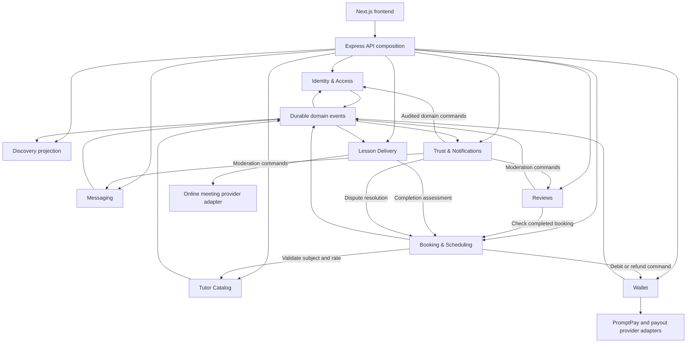

# Microservice Design with Collaborations — Tutor Matcher

**Status:** Proposed architecture, not an accepted ADR or a description of deployed services.
**Updated:** 2026-09-07.

## Basis and scope

This design derives service boundaries from the current product documentation. It excludes
`backlog.yaml` and does not use other backlog artifacts to establish requirements. Historical
database-course designs are also excluded.

| Source                                                                                                                                                                                   | What this design takes from it                                                       |
| ---------------------------------------------------------------------------------------------------------------------------------------------------------------------------------------- | ------------------------------------------------------------------------------------ |
| [User journeys](user-journeys.md)                                                                                                                                                        | Access, discovery, booking, wallet, delivery, messaging, reviews, and admin behavior |
| [Project charter](project-charter.md)                                                                                                                                                    | Product purpose, capabilities, and scope                                             |
| [Domain vocabulary](../CONTEXT.md)                                                                                                                                                       | User, tutor, subject, availability slot, booking, lesson, and wallet terminology     |
| [Project schema](project-schema.md)                                                                                                                                                      | Documented storage constraints and gaps G1–G18; not a ready-made service split       |
| [Project architecture](project-architecture.md) and [ADR 0001](adr/0001-separate-express-backend.md), [0002](adr/0002-monorepo-layout.md), [0003](adr/0003-docker-compose-deployment.md) | Separate Express API, Next.js frontend, monorepo, PostgreSQL, and Compose deployment |
| [Preserved prototype README](sources/tutormatcher-prototype-readme.md) and [user stories](sources/tutormatcher-prototype-user-stories.md)                                                | Behavioral evidence underlying the canonical journeys                                |

The documented journeys provide enough behavior to propose the boundaries below; no new prototype
walkthrough was performed. Unsettled policy remains explicitly open. All service names, internal
contracts, event names, and recovery mechanisms below are design proposals, not existing APIs.

## Architectural position

Keep the accepted Next.js → Express API boundary and monorepo. Introduce explicit domain ownership
inside the existing backend first, then extract independently deployed services where there is a
concrete operational benefit. The existing backend modules are not already microservices.

The target is eight business services, an API composition layer, and a Discovery projection. This is
a logical target, not a requirement to deploy every component separately for the initial release.
Booking and Wallet should remain in one deployment and transaction boundary initially: separating
them introduces a recovery protocol into the product's most important operation.

The proposed boundaries follow these product rules from [User Journeys → Invariants](user-journeys.md#invariants):

- One user account has layered student, tutor, and admin capabilities and one wallet.
- One booking buys one subject and one continuous block of a tutor's 30-minute slots.
- A slot can advertise several subjects, but only one booking can occupy it at a time.
- Payment confirms the booking immediately, without tutor acceptance.
- The wallet ledger explains every movement of money; available and pending funds differ.
- Listing changes require approval, and reviews require the author's own completed booking.

## Service boundaries and data ownership

Each service exclusively writes its own data. Other services use commands, queries, or events;
they do not share Prisma models or query another service's tables. Cross-service IDs are references,
not cross-database foreign keys. Names below describe proposed aggregates rather than SQL table names.

| Service                   | Owns                                                                                                                               | Main responsibilities and boundary rationale                                                                                                                                                                                                                         |
| ------------------------- | ---------------------------------------------------------------------------------------------------------------------------------- | -------------------------------------------------------------------------------------------------------------------------------------------------------------------------------------------------------------------------------------------------------------------- |
| **Identity & Access**     | User, credentials/federated identity links, sessions or tokens, capabilities, account restrictions                                 | Sign-up defaults to student; login, Google login, reset, account settings, tutor capability grants, suspension and bans. One authority for who may act. Authentication technology remains deferred.                                                                  |
| **Tutor Catalog**         | Tutor Application, Verification Document metadata, live Listing and proposed revisions, Subject                                    | Application review, listing/document approval, publication, subject content, format and rate. Keep drafts and approved public content separate. Own private document access even if bytes live in external storage.                                                  |
| **Booking & Scheduling**  | Availability Slot, subject assignments to slots, Booking, occupied slot collection, price snapshot, hold and payment-attempt state | Per-date availability, continuous-slot validation, payment-due holds, booking lifecycle, cancellation policy evaluation, completion eligibility acceptance. Keep slots and bookings together to prevent double-selling in one local transaction.                     |
| **Wallet**                | Wallet, Wallet Transaction, pending Earning, Payout Account, top-up/payout attempts, financial allocation per booking              | All balance changes, lesson debits, refunds, clearing, payout processing, provider reconciliation. Keep money in one service so spending on a lesson and withdrawing compete against the same available balance.                                                     |
| **Lesson Delivery**       | Meeting reference, provisioning attempts, attendance evidence, completion assessment                                               | Provision online rooms, authorize join, collect delivery evidence, propose completion. Booking remains the owner of the booking status.                                                                                                                              |
| **Messaging**             | Conversation, Message, unread state, message visibility                                                                            | Student–tutor conversations before and after booking; participant authorization and context switching. The same user ID works in both contexts.                                                                                                                      |
| **Reviews**               | Review, tutor reply, review visibility, rating aggregates                                                                          | Verify completed-booking eligibility, enforce one review per booking and one tutor reply, scope reviews to tutor and subject, apply moderation.                                                                                                                      |
| **Trust & Notifications** | Report/dispute cases, admin decision audit, Notification Preference, dispatch and reminder records                                 | Coordinate admin queues and dispatch notifications. Keep case handling and notification delivery as separate internal modules/workers; split them into services later if their access or load requirements justify it. Domain owners still execute approved changes. |

**Discovery** is a rebuildable read projection of approved public listings, published subjects,
visible review aggregates, and availability summaries. It supports the documented filters and sorts;
the Recommended ranking formula is still unspecified. It owns no bookable inventory or prices.

**API composition** routes `/api/*` and combines data for dashboards, tutor pages, and booking detail.
It can initially be the existing Express route layer. It owns no domain tables. Next.js remains the
UI and same-origin API proxy; it does not connect to service databases.

Dashboards and admin pages are composed views, not services per screen. A dashboard combines Booking,
Wallet, Catalog, and Reviews; an admin queue combines Catalog-owned applications with Trust-owned
reports. Only the relevant owner changes the underlying state.

## Collaboration map



Arrows distinguish direct commands/queries from event delivery. This is not a complete authorization
graph: every protected entry point must enforce Identity's account restrictions and its own resource
ownership rules. A gateway check alone is insufficient.

## Collaboration 1: apply, approve, publish, discover

1. Identity creates one student account. Catalog accepts a Tutor Application containing the required
   government ID document, teaching certification document, and bio.
2. An authorized admin reviews the exact application version through Catalog. Catalog atomically
   records the approval/rejection and its audit reference, then publishes the outcome.
3. Identity consumes `TutorApplicationApproved` idempotently and grants the tutor capability to that
   same user. The application response may track capability activation until this finishes; tutor
   actions remain blocked until Identity confirms the grant. Rejection does not grant a capability.
4. A pending cancellation and an admin decision compete on the application version, so an approval
   cannot apply to a cancelled or superseded submission.
5. Catalog keeps listing/document edits in a proposed revision. Approval publishes that revision;
   rejection preserves the live listing and records the reason.
6. Discovery updates from `ListingPublished`, `SubjectChanged`, and rating/availability events.
   Public queries expose approved content only. Discovery can lag, so Booking validates eligibility
   and obtains the authoritative rate from Catalog before creating a booking.

Listing/document approval does not imply every subject edit needs approval; that extra rule is not
established by the journeys. Catalog defines a versioned subject quote for Booking. Booking records
the accepted subject version and price; later rate changes cannot rewrite an existing booking.

## Collaboration 2: select slots, top up, and confirm

```mermaid
sequenceDiagram
    actor Student
    participant API as Express API
    participant B as Booking & Scheduling
    participant C as Tutor Catalog
    participant W as Wallet
    participant L as Lesson Delivery
    Student->>API: Continue with subject and continuous slot block
    API->>B: CreateBooking with idempotency key
    B->>C: Validate bookability and obtain subject quote
    C-->>B: Tutor, subject version, rate, format
    B->>B: Atomically claim all slots and save payment-due booking
    B-->>Student: Booking number, fixed price, payment page
    opt Insufficient available balance
        Student->>W: Request top-up QR
        W->>W: Verify provider confirmation and credit once
        W-->>Student: Updated wallet; return to booking
    end
    Student->>API: Pay booking with idempotency key
    API->>B: PayBooking
    B->>B: Pin valid hold to durable payment attempt
    B->>W: CaptureLessonPayment with attempt ID and fixed amount
    W->>W: Atomically debit available funds and record result
    W-->>B: Durable payment reference
    B->>B: Confirm booking and persist BookingConfirmed event
    B-->>Student: Confirmed booking and payment reference
    B-->>L: BookingConfirmed via durable events
    L->>L: Provision online meeting and persist reference
```

**Local correctness.** No booking exists while merely selecting time. Continuing locks the complete
block or creates nothing. Validate contiguity, subject assignments, tutor ownership, publication,
future times, and the documented booking horizon. Lock slots in a deterministic order and enforce
one active claim per tutor/slot, across all subjects advertising that slot. Availability edits must
respect unpaid holds as well as paid locks. Store start/end, duration, subject/rate version, total,
currency, and policy version on the booking. Calculate money with exact decimal or minor-unit
arithmetic and an explicit rounding rule.

**Initial implementation.** While Booking and Wallet share one transactional database, the payment
operation should atomically validate the hold, debit the wallet, and confirm the booking. Module
ownership still applies; this is a deliberate shared transaction boundary before service extraction.

**After service extraction.** There is no shared transaction. Booking orchestrates a durable payment
workflow with these constraints:

- Before sending a capture, persist an attempt and pin its slots. Expiry and cancellation cannot
  release those slots while the capture outcome is unknown. Do not hold a database transaction open
  across a network call.
- Wallet accepts captures only from authenticated Booking callers, checks the server-supplied amount
  and payer, serializes competing debits, and enforces one successful lesson payment per booking.
  Repeating an attempt returns the same result; changing its payload is rejected.
- If Wallet commits but the response is lost, Booking queries/retries that same attempt and confirms
  from the recorded result. A timeout is not evidence that payment failed. Keep the UI in a recoverable
  processing state and retain slots until reconciliation resolves it.
- To abandon an uncertain attempt, obtain a durable terminal rejection/abort from Wallet. That result
  must prevent a delayed capture for the same attempt. Only then may Booking release the slots or
  allow a new attempt. An unpaid hold with no in-flight capture can expire locally.
- On success, Booking records confirmation and its outbox event together. Recovery repeats this
  transition safely after a crash. Do not refund a second student's payment as a way to resolve
  double-selling: competing claims must fail before either invalid capture is sent.

The normal response confirms payment immediately without tutor approval. During partial failures,
the system cannot promise simultaneous visibility in two databases; it must reconcile and expose
processing honestly. This cost is the main reason to defer Booking/Wallet extraction.

**Meeting readiness.** Provision the meeting idempotently using the booking ID. A provider outage
must not charge again or erase confirmation. Booking detail composes the meeting reference once
available, with an explicit retrying state meanwhile. This temporary state is a proposed failure UX
that needs agreement; the normal documented confirmed screen includes the meeting link.

## Collaboration 3: delivery, completion, earnings, and reviews

1. Lesson Delivery consumes `BookingConfirmed`, provisions the online room, and authorizes the
   booking's student/tutor before exposing a join link. A cancellation prevents subsequent joins.
2. After the scheduled lesson, Delivery submits attendance evidence and a completion assessment.
   Booking checks its current state and the applicable completion rule before moving `confirmed`
   to `completed`. Missing or inadequate evidence is flagged rather than silently counted as delivery.
3. Booking publishes `BookingCompleted`. Wallet creates the tutor's pending earning once, using the
   booking's financial allocation and policy snapshot. Pending money cannot fund bookings or payouts.
4. A durable Wallet worker clears eligible earnings once the clearing time and any dispute hold permit
   it. Clearing transfers pending money into available money; it must not credit the earning twice.
5. Reviews accepts a submission only after checking the caller against Booking's authoritative
   completed booking. It derives tutor and subject IDs from that booking and enforces uniqueness on
   booking ID. It does not trust a browser-supplied tutor/subject pair or a stale completion projection.
6. Reviews publishes changes to visible ratings for Discovery. Tutor replies require ownership of
   the reviewed tutor's account. Notifications dispatch eligible completion and earning updates.

The journeys mention online and in-person subject formats, but the delivery flow specifies an online
meeting. In-person attendance and completion evidence need a policy before that format can use the
same automated completion workflow.

## Collaboration 4: cancellation, disputes, and refunds

1. Booking authorizes the participant, checks lifecycle state, calculates a cancellation quote from
   the applicable policy, and shows the consequence before confirmation. Quote/version validation
   prevents a stale quote from silently applying a different financial outcome.
2. An unpaid cancellation releases its hold only if no payment attempt can still capture. A paid
   cancellation records `cancelled`, releases future inventory, and persists a refund instruction
   together. Cancellation and completion serialize on the booking version so only one transition wins.
3. Wallet applies the authorized financial adjustment idempotently. If Wallet is unavailable, the
   booking stays cancelled and the refund is visibly pending; a durable retry completes it later.
4. A dispute is owned by Trust. The admin decision is audited, then routed through Booking's financial
   adjustment contract. Trust never edits balances or reviews a bank transfer screenshot as payment.
5. Wallet serializes refunds, earnings clearing, and dispute holds against the same booking allocation.
   It caps cumulative refunds at the eligible paid amount and prevents both a full refund and an
   unadjusted tutor earning from being allocated from the same money.

A refund after earnings have cleared or been paid out requires an explicit funding/recovery policy.
Record that as an unresolved case until the policy exists; do not silently take another user's
available money or invent a negative-balance rule. Rescheduling is outside this proposal while its
product scope remains unresolved.

## Collaboration 5: top-ups and payouts

Wallet owns provider adapters and authoritative transaction outcomes. A browser redirect or a fake
prototype success action cannot credit money. A top-up is credited only after authenticated provider
confirmation, with a unique provider transaction reference and verified amount, currency, and user.

Any user can request a payout to their saved Payout Account. Wallet checks account ownership and
available funds, then atomically makes the amount unavailable and records the payout attempt. A
durable worker submits it with a stable provider reference. Success finalizes the debit; a definitive
failure restores funds through a recorded adjustment. An unknown outcome stays pending and is
reconciled before either resubmission or restoration. Concurrent booking payments and payouts cannot
spend the same available funds.

Maintain an immutable financial journal with balanced internal allocations for funds awaiting lesson
delivery, tutor earnings, platform fees, and external transfers. These are accounting allocations,
not additional student/tutor wallets. Derive the user-facing transaction history and balance from
that journal; any cached balance is updated atomically with its entries and can be reconciled.

## Collaboration 6: conversations, moderation, and notifications

- Messaging verifies both conversation participants; a booking is not required to send the first
  message. Student/tutor context selects a view of the same account's conversations, not another login.
- A message or review flag creates a Trust case with a source reference. A uniqueness rule rejects
  duplicate flags by the same user for the same content. Trust records the admin outcome and commands
  the owning service to keep, hide, or remove content. Case resolution remains pending until that
  service acknowledges the outcome; retries cannot apply it twice.
- Suspension/ban decisions are applied by Identity. Protected commands check current restrictions,
  using an authoritative check or a revocable authorization mechanism. A stale search entry or token
  cannot grant permission to perform a newly blocked action.
- Notifications consume booking, wallet, application, and message events. Each dispatch checks the
  user's current event/channel preference. Disabled preferences suppress that channel, including on
  retries. Reminder jobs recheck booking status and time before sending, so cancelled lessons do not
  produce reminders. Authentication reset delivery is handled separately from optional product news.

## Contracts, reliability, and security

| Contract                              | Caller → owner                   | Result or event                                   | Consistency                                                          |
| ------------------------------------- | -------------------------------- | ------------------------------------------------- | -------------------------------------------------------------------- |
| `CreateBooking`                       | API → Booking                    | Fixed-price payment-due booking and slot claim    | Atomic across every selected slot                                    |
| `PayBooking` / `CaptureLessonPayment` | API → Booking → Wallet           | Payment reference, then `BookingConfirmed`        | Shared transaction initially; durable orchestration after extraction |
| `CancelBooking`                       | API → Booking                    | `BookingCancelled`, authorized refund instruction | Booking/inventory atomic; refund completion may lag                  |
| `AssessCompletion`                    | Delivery → Booking               | `BookingCompleted` if eligible                    | Version-checked lifecycle transition                                 |
| `ApproveApplication`                  | Admin API → Catalog              | `TutorApplicationApproved` → Identity             | Approval durable; capability activation acknowledged separately      |
| `SubmitReview`                        | API → Reviews → Booking query    | `ReviewPublished`                                 | Authoritative eligibility and local uniqueness                       |
| `RequestPayout`                       | API → Wallet                     | Durable payout attempt                            | Available balance and payout debit atomic                            |
| `ResolveReport`                       | Admin API → Trust → domain owner | Audited, acknowledged outcome                     | Idempotent commands with retry                                       |

Commands carry actor identity, an idempotency key, and an expected version where state can race.
Events carry `eventId`, `eventType`, `schemaVersion`, `aggregateId`, `aggregateVersion`, `occurredAt`,
and correlation/causation IDs. Financial instructions additionally carry stable booking/payment
references, exact amount/currency, and the relevant policy version. Internal contracts are versioned
separately from frontend page URLs; the journeys specify pages, not REST endpoint contracts.

Use a transactional outbox: persist a state change and the event to publish in the same local
transaction. Consumers atomically deduplicate event IDs with their own state changes. Assume
at-least-once delivery; use aggregate versions to reject stale projection updates and detect gaps.
Retries use bounded backoff, with failed work retained for inspection and replay. An event transport
is required for extracted services, but no broker product is selected by this proposal.

Do not put passwords, reset tokens, verification documents, bank details, or meeting secrets in broad
event payloads. Use private storage references and authorized retrieval. Authenticate service calls,
authorize money commands by service and actor, and maintain decision IDs across admin actions and
financial adjustments. Services have separate database credentials; shared hosting does not grant
cross-service table access.

Track payment attempts with unknown outcomes, held slots past expiry, outbox age, failed callbacks,
pending refunds/payouts, meeting provisioning failures, and ledger reconciliation differences.
Correlation IDs must connect the browser request, booking, wallet operation, provider reference, and
admin resolution without logging sensitive payloads.

## Adoption within the accepted project architecture

1. **Establish modules and close schema gaps.** Keep the Express application and PostgreSQL deployment.
   Map `auth` to Identity; split `profile` responsibilities into account settings and Catalog;
   keep availability with `booking`; map `classroom`, `wallet`, `messaging`, and `review` to their
   owners. Keep `dashboard` as composition and `discovery` as a query module. Add Trust/notification
   modules. Health endpoints remain operational infrastructure.
2. **Implement reliable local transactions and worker contracts.** Address G1–G7 before paid booking
   delivery, including the multi-slot relation, lifecycle, historical pricing, tutor-owned slots,
   nullable meeting reference before provisioning, and wallet structure. Add the missing records
   G8–G18 as their journeys are implemented. See the [schema gap list](project-schema.md#reconciliation-requirement-vs-implementation)
   for exact requirements; this document does not claim those gaps have been fixed.
3. **Extract peripheral workers/services first.** Notifications, meeting provisioning, and Discovery
   have useful asynchronous boundaries. Introduce owner-specific schemas/databases and migrations,
   service identities, event delivery, health checks, and deployment entries when actually extracting.
   Keep shared types limited to versioned contracts, not repositories or domain persistence models.
4. **Extract Booking and Wallet only after recovery is proven.** Backfill and reconcile ledger data,
   cut over to one writer per domain, and exercise the uncertain-payment protocol before enabling
   remote capture. Do not use indefinite dual writes as the migration strategy.

Continue using the monorepo and Compose deployment shapes from the accepted ADRs. Extraction would
require new service build/deploy entries in the local and production manifests and a new ADR for the
changed topology. A service mesh, Kubernetes migration, database technology change, or repository
split is not a prerequisite in this proposal.

## Verification criteria

Extend the existing [Jest/Supertest and Cucumber suites](testing.md) with observable domain scenarios.
Use real database transactions for race and ledger tests, controlled provider stubs for callbacks,
contract tests for extracted services, and browser journeys for the user-visible result.

| Scenario                                                                    | Required evidence                                                                   |
| --------------------------------------------------------------------------- | ----------------------------------------------------------------------------------- |
| Two students select overlapping slots, including through different subjects | Only one complete block is held; losing request makes no debit                      |
| Duplicate Pay, lost Wallet response, or process crash after debit           | One debit and eventual confirmation; inventory retained until outcome resolved      |
| Hold expiry races a delayed capture                                         | No released slot can subsequently be paid through the abandoned attempt             |
| Payout races a booking payment                                              | Available funds cannot be spent twice or go below the allowed balance               |
| Top-up/payout callbacks repeat or arrive late                               | One financial outcome; unknown outcomes do not trigger blind credit or resubmission |
| Cancellation races completion or earning clearing                           | One legal booking transition and a consistent refund/earning allocation             |
| Admin rejects a listing revision                                            | Previously approved public content remains unchanged                                |
| Review submitted before completion or for another student's booking         | Rejected; tutor/subject cannot be forged; duplicate review rejected                 |
| Meeting provider or notification delivery is unavailable                    | Booking remains correct; work retries; disabled channels stay suppressed            |
| Account is suspended after login                                            | Subsequent protected commands are denied despite old UI state                       |

## Decisions still needed

These are limits of the available requirements, not values to infer from deprecated backlog items.

| Decision                                                                          | Needed before                                                                                            |
| --------------------------------------------------------------------------------- | -------------------------------------------------------------------------------------------------------- |
| Payment-due hold lifetime, expiry behavior, and top-up return after expiry        | Shipping slot holds; the journeys require release but specify no timeout                                 |
| Cancellation/refund matrix, fee rounding, and version application                 | Shipping cancellation and settlement; prototype values of 12 hours, 15%, and 24 hours remain provisional |
| Dispute timing, earning holds, and funding refunds after cleared earnings/payouts | Shipping disputes and settlement                                                                         |
| Attendance thresholds, evidence source, exceptions, and in-person completion      | Enabling automatic completion                                                                            |
| Authentication, capability revocation, and service authentication mechanism       | Enforcing extracted-service authorization                                                                |
| Payment/payout provider contracts and document storage                            | Integrating real external money and private verification files                                           |
| Meeting-link provisioning failure UX and maximum acceptable delay                 | Enabling asynchronous meeting creation                                                                   |
| Whether rescheduling belongs in the product                                       | Adding any rescheduling contract                                                                         |
| Event transport and service extraction criteria                                   | Moving from the modular backend to independently deployed services                                       |

Product behavior remains owned by [user-journeys.md](user-journeys.md), vocabulary by
[CONTEXT.md](../CONTEXT.md), and current database structure by Prisma as described in
[project-schema.md](project-schema.md). Accepting this proposal should create an ADR rather than
silently changing those authorities.
